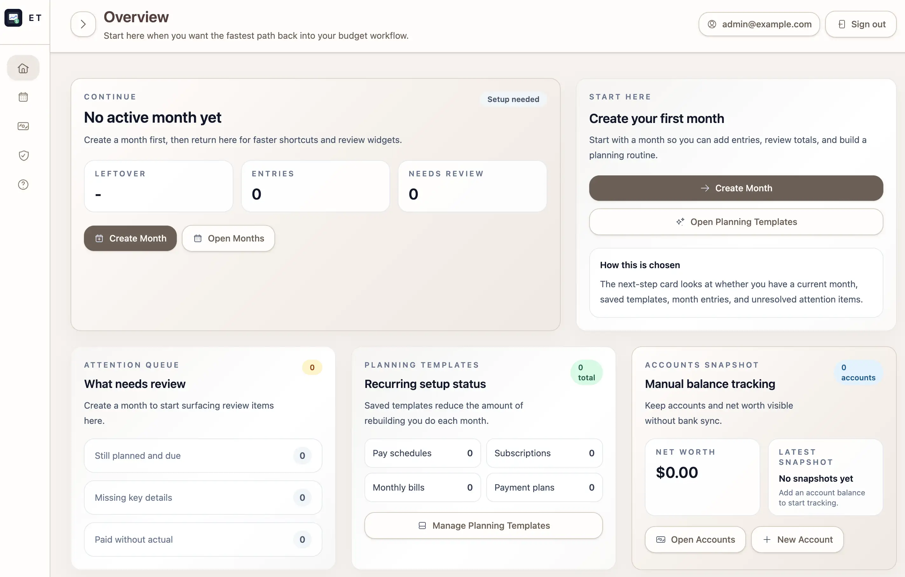
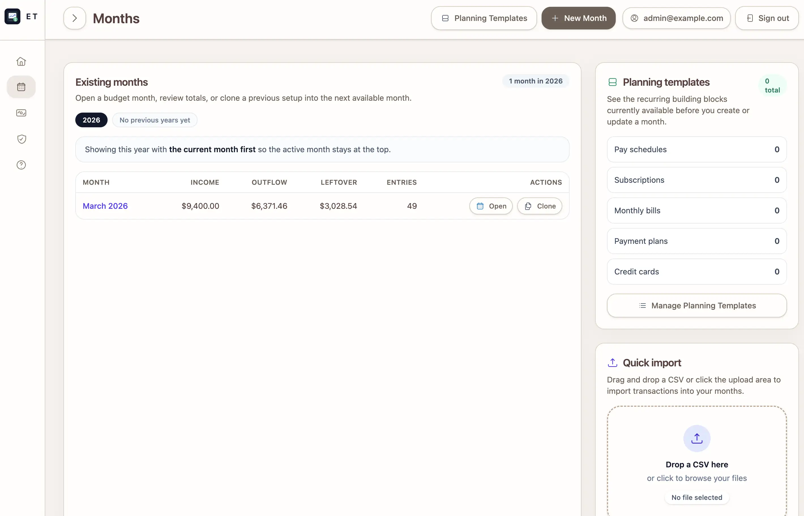
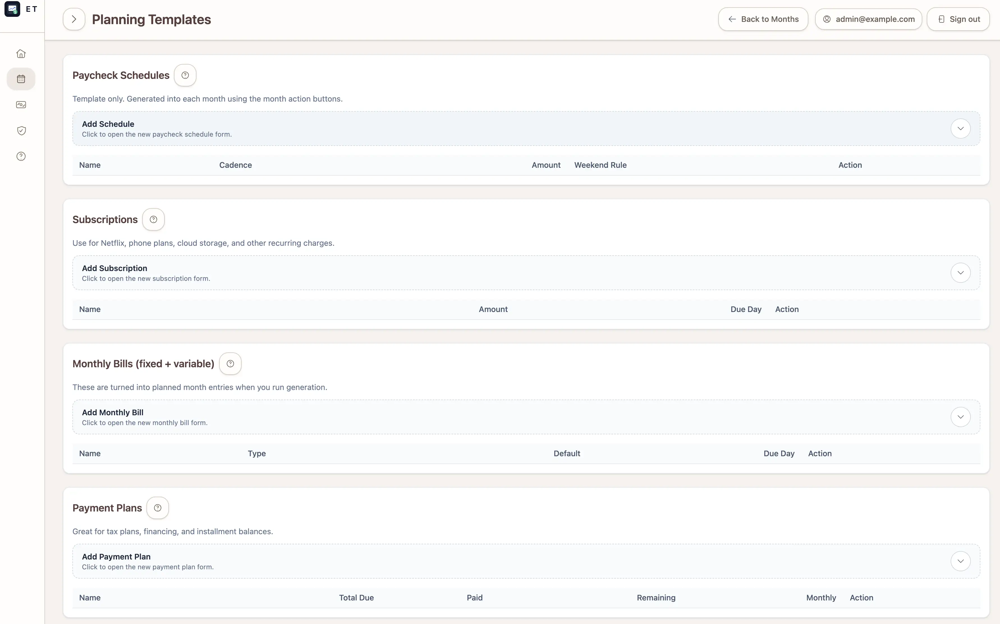
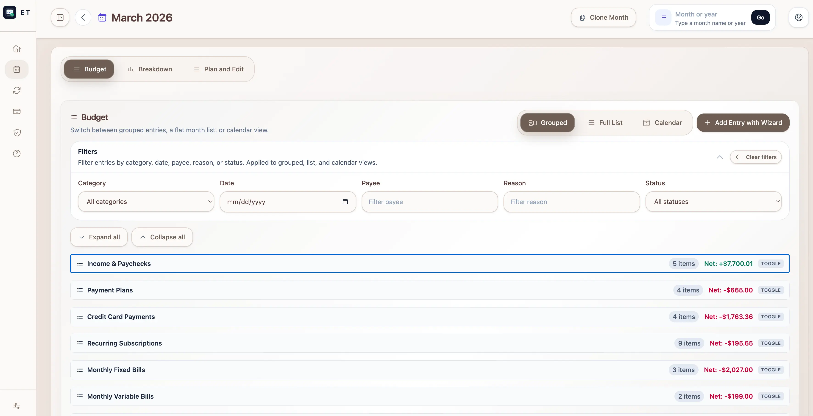
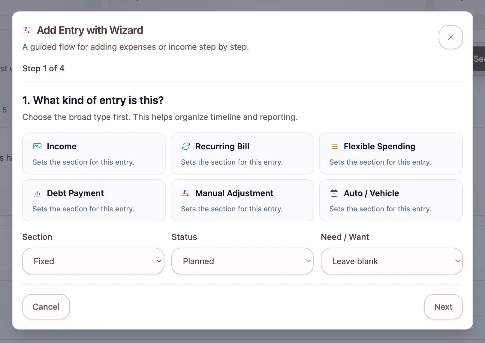
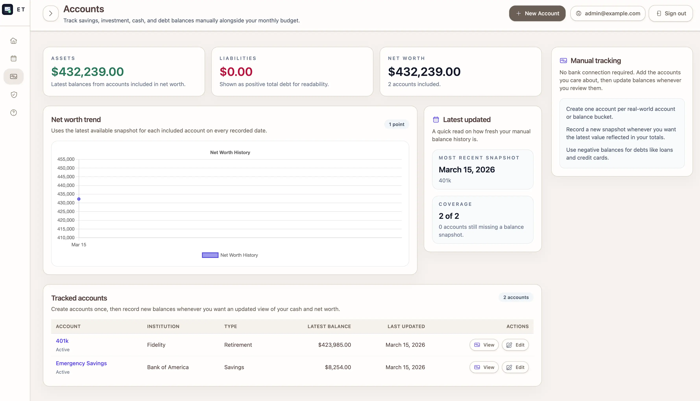
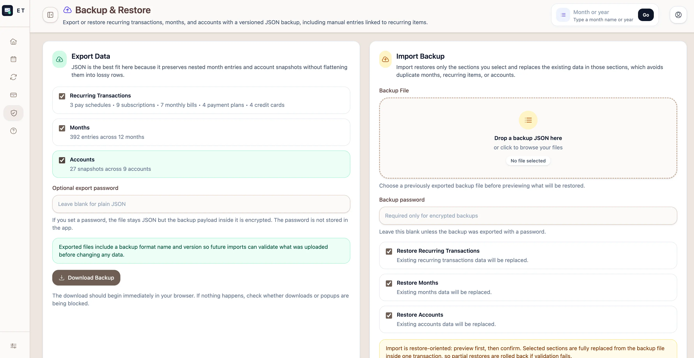

# Expense Tracker

A budgeting app for building month-by-month spending plans, tracking real activity, and reusing the recurring parts of a household budget.

## Table of Contents

- [Overview](#overview)
- [Quick Start (Docker)](#quick-start-docker)
- [Screenshots](#screenshots)
- [Features](#features)
- [Tech Stack](#tech-stack)
- [Getting Started](#getting-started)
	- [Run with Docker](#run-with-docker)
	- [Run Locally](#run-locally)
- [Authentication](#authentication)
- [Self-Hosted HTTPS](#self-hosted-https)
- [Updating a Self-Hosted Install](#updating-a-self-hosted-install)
- [Demo and Sample Data](#demo-and-sample-data)
	- [Sample User](#sample-user)
	- [Seeded Demo Month](#seeded-demo-month)
	- [Sample CSV Files](#sample-csv-files)
- [Workflow](#workflow)
	- [Overview Dashboard](#overview-dashboard)
	- [Accounts and Net Worth](#accounts-and-net-worth)
	- [Account Linkage Model](#account-linkage-model)
	- [Create a Month](#create-a-month)
	- [Clone Month Behavior](#clone-month-behavior)
	- [Add or Import Entries](#add-or-import-entries)
	- [Planning Templates](#planning-templates)
	- [Review a Month](#review-a-month)
	- [Backup and Restore](#backup-and-restore)
	- [Help and Documentation](#help-and-documentation)
- [Open Source Readiness](#open-source-readiness)
- [Development Commands](#development-commands)
- [Troubleshooting](#troubleshooting)
- [Docker Files](#docker-files)

## Overview

Expense Tracker is built for people who budget by month and want one place to plan income, fixed bills, variable spending, debt payments, and carry-over decisions.

It also includes a manual accounts area for tracking balances in checking, savings, brokerage, retirement, and debt accounts without relying on live bank syncing.

Planning templates and month entries can optionally link to accounts, so account context carries through month workflows instead of living only in the balances area.

Hosted product overview and screenshots: https://financetracking.app/

With it, a user can:

- restart from an overview dashboard that highlights the current month, quick actions, planning-template status, and account context
- build a fresh month or start from a previous month instead of recreating the same structure every time
- review the same budget in a timeline, calendar, or editable list depending on how they like to think about money
- import transactions from CSV files to get a month filled in faster
- reuse recurring items so routine planning takes less manual work through dedicated planning templates
- preview and restore versioned JSON backups, including optional encrypted exports and reference sample backup files
- estimate credit-card payments based on the cash left in the month rather than guessing in isolation
- record manual account balance snapshots and review a simple net worth trend over time
- keep in-app help available so the intended workflow is documented inside the product

The sections below are split between user-focused guidance for using the app and developer-focused guidance for running, testing, and publishing the project.

For most people, the easiest way to try the app is the Docker setup below because it avoids local Ruby, PostgreSQL, and system package setup.

## Quick Start (Docker)

If the goal is to get the app running as quickly as possible, use Docker:

1. Clone the repository and move into it
	- `git clone <repo-url>`
	- `cd expense_tracker`
2. Install Docker Desktop
3. Optional: create a local env file for port, admin, or seed overrides
	- `cp .env.example .env`
4. Start the app
	- `docker compose up --build`
5. Open the app
	- http://localhost:4287
6. Optional: load seed data in another terminal
	- users only: `docker compose exec web bin/rails db:seed`
	- users with transactions: `docker compose exec web env SEED_MODE=users_with_transactions bin/rails db:seed`

This Docker setup is meant to run from a local git checkout of the repository. That is what makes later updates work with `git pull` followed by `docker compose up -d --build`.

If you set `ADMIN_USER_EMAIL` and `ADMIN_USER_PASSWORD` in `.env` before starting Docker, the app will create or update the admin account automatically during startup.

If `4287` is already in use, set `APP_PORT` before starting Docker, for example `APP_PORT=4317 docker compose up --build`.

After startup, admins can sign in through `/admin/sign_in` if `ADMIN_USER_EMAIL` and `ADMIN_USER_PASSWORD` were configured. Regular users can create their own accounts at `/users/sign_up`. After seeding, you can also sign in with the demo account described in the [Sample User](#sample-user) section. Use `SEED_MODE=users_with_transactions` if you also want the sample month, recurring demo templates, and manual account balance history.

## Screenshots

Current screenshots reflect the latest overview, planning templates, month review, accounts, and backup workflow.

<table>
	<tr>
		<td align="center">
			
			 
			<strong>Overview Dashboard</strong>
			 
			Current month, attention items, planning-template status, account context, and quick actions from one landing screen.
		</td>
		<td align="center">
			
			 
			<strong>Months</strong>
			 
			Open the month list, create a month, review template coverage, and import CSV activity.
		</td>
	</tr>
	<tr>
		<td align="center">
			
			 
			<strong>Planning Templates</strong>
			 
			Reusable paycheck, subscription, bill, payment-plan, and credit-card definitions for faster month setup.
		</td>
		<td align="center">
			
			 
			<strong>Timeline Review</strong>
			 
			Grouped timeline sections, filters, and leftover context for month review.
		</td>
	</tr>
	<tr>
		<td align="center">
			
			 
			<strong>Guided Entry Wizard</strong>
			 
			Multi-step entry flow for adding one-off items and optionally saving supported entries as templates.
		</td>
		<td align="center">
			
			 
			<strong>Accounts &amp; Net Worth</strong>
			 
			Manual balance tracking, coverage metrics, and net worth trend snapshots.
		</td>
	</tr>
	<tr>
		<td align="center" colspan="2">
			
			 
			<strong>Backup &amp; Restore</strong>
			 
			Versioned JSON exports, optional encryption, import previews, and reference sample backups.
		</td>
	</tr>
</table>

## Features

- Start from an overview dashboard that surfaces the current month, attention items, planning-template progress, account summaries, and quick actions
- Plan each month in one place so income, bills, subscriptions, debt payments, and discretionary spending stay visible together
- Start a new month quickly by cloning an existing one, which saves time when your budget structure stays mostly the same
- See your budget in multiple views so you can review the same data as a timeline, a calendar, a breakdown, or a detailed entry list
- Add transactions the way that fits your workflow, whether that means entering them manually, using the guided wizard, launching the wizard from month views, or importing a CSV
- Upload past transactions to get a month populated faster instead of rebuilding everything by hand
- Reuse recurring items like paychecks, subscriptions, monthly bills, payment plans, and credit cards so routine planning takes less effort
- Save supported wizard-created entries directly as planning templates when you want a one-off action to become reusable later
- Filter entries by the reasons and categories that actually appear in your month, making it easier to focus on specific spending patterns
- Toggle between grouped timeline sections and a full month list without leaving the same review surface
- Recalculate card payment estimates from available leftover cash so payoff planning stays aligned with the rest of the month
- Link templates and entries to accounts while still allowing a manual account label when needed
- Show linked account context directly in month review views and account activity
- Export and restore planning templates, months, and account data through versioned JSON backups with optional password encryption
- Preview imports before restoring anything, and use a sample backup file to inspect the expected structure
- Track manual balances for savings, investment, cash, and debt accounts without coupling budgeting to bank-sync reliability
- Keep workflow guidance available inside the app through a dedicated Help area
- Avoid accidental duplicate generation on older completed months with safeguards that hide actions you likely no longer need
- Keep each person’s budget private behind sign-in so one account only sees its own months and entries

## Tech Stack

For developers and contributors, the app is built with:

- Ruby 4.0.1
- Rails 8.1.2
- PostgreSQL
- Devise
- Turbo + Stimulus
- Tailwind CSS
- RSpec + FactoryBot

## Getting Started

For most users, Docker is the recommended way to run the app.

Use Docker if you want the quickest path to opening the app without manually setting up Ruby, PostgreSQL, or system dependencies.

Use the local setup only if you plan to develop on the project or prefer managing those dependencies yourself.

### Run with Docker

This is the recommended setup for most users.

The repository includes a Docker-based environment that starts the Rails app and PostgreSQL together.

This setup assumes you are running Docker Compose from a local clone of this repository, not from a standalone prebuilt image. Keep that local checkout, because future updates are done by pulling new commits into it and rebuilding the containers.

#### Prerequisites

- Docker Desktop, or Docker Engine + Docker Compose

#### Start the app

1. Clone the repository and move into it
	- `git clone <repo-url>`
	- `cd expense_tracker`
2. Optional: copy the example environment file and adjust any values you want to override
	- `cp .env.example .env`
3. Build and start the containers
	 - `docker compose up --build`
4. Open the app
	 - http://localhost:4287

Start the full Compose stack from this directory. Do not start the `web` container by itself with `docker run` or from a GUI action that skips the `db` service, because the Rails container expects to reach PostgreSQL at the Compose hostname `db`.

For access from the same machine, use `http://localhost:4287`.

For access from another device on your network, use `http://YOUR_COMPUTER_IP:4287`. The Docker setup enables non-localhost hosts for development, but your OS firewall and router still need to allow inbound connections to that port.

The Docker setup publishes the app on host port `4287` by default to avoid the more commonly used `3000`.

To override it, set `APP_PORT` in your shell or a local `.env` file before starting Docker.

For convenience, copy `.env.example` to `.env` and edit the values you want to override.

Because the app is running from your local checkout, later updates are done from this same directory with:

- `git pull`
- `docker compose up -d --build`

Examples:

- `APP_PORT=4317 docker compose up --build`
- `.env` file entry: `APP_PORT=4317`

Services included:

- `web` — Rails app running via `bin/dev`
- `db` — PostgreSQL 16 on the internal Compose network

The PostgreSQL container is not published to a host port by default. The Rails app connects to it over the Compose network as `db`, which avoids conflicts on machines that already use port `5432` for another local PostgreSQL instance.

The container entrypoint automatically runs `bin/rails db:prepare` when the app starts.

If `ADMIN_USER_EMAIL` and `ADMIN_USER_PASSWORD` are present in the container environment, the entrypoint also runs `bin/rails admin:bootstrap` so the admin account exists from the initial install.

#### Optional: load seed data

In another terminal:

- users only: `docker compose exec web bin/rails db:seed`
- users with transactions: `docker compose exec web env SEED_MODE=users_with_transactions bin/rails db:seed`

The default command creates the demo account only. Use `SEED_MODE=users_with_transactions` to also create the sample month, recurring demo templates, and manual accounts with balance snapshots.

If you prefer storing these overrides in `.env` before running Docker, set:

- `ADMIN_USER_EMAIL=admin@example.com`
- `ADMIN_USER_PASSWORD=strong-password`
- `SEED_MODE=users_with_transactions` when you want full demo data

Then:

- run `docker compose up --build` to install and bootstrap the admin user automatically
- run `docker compose exec web bin/rails db:seed` only if you also want the demo user and sample budgeting data

From there, the admin can sign in through `/admin/sign_in`, and end users can create their own accounts through `/users/sign_up`.

#### Automatic recurring completion

Due recurring template-generated entries are automatically marked as done by setting their status to `paid` and copying the planned amount into the actual amount when needed.

This works in two ways:

- month pages run a small sync when opened, so self-hosted installs still update during normal use
- production also schedules a daily Solid Queue job for unattended auto-completion

For self-hosted production:

- single-server installs can keep using the existing `SOLID_QUEUE_IN_PUMA=true` setup so jobs run inside Puma
- multi-server installs should move job processing to a dedicated `bin/jobs` process or job host

The recurring schedule lives in [config/recurring.yml](config/recurring.yml).

#### Stop the app

- `docker compose down`

To also remove the database volume:

- `docker compose down -v`

### Run Locally

This setup is mainly for developers and contributors.

#### Prerequisites

- Ruby 4.0.1
- Bundler
- PostgreSQL
- libpq development headers
- libvips

Typical macOS setup with Homebrew:

- `brew install postgresql libpq vips`

Make sure PostgreSQL is running before starting the app.

#### Setup

1. Create a local env file
	 - `cp .env.example .env`
2. Install gems
	 - `bundle install`
3. Prepare the database
	 - `bin/setup --skip-server`
4. Optional: load seed data
	 - users only: `bin/rails db:seed`
	 - users with transactions: `SEED_MODE=users_with_transactions bin/rails db:seed`
5. Start the development server
	 - `bin/dev`

Open http://localhost:3000. Admins sign in through `/admin/sign_in`, and regular users can register through `/users/sign_up` before signing in to start creating budget months.

The `Accounts & Net Worth` area is available from the signed-in sidebar if you want to track manual balances alongside the monthly budgeting workflow.

`bin/setup` runs `bin/rails db:prepare` and then `bin/rails admin:bootstrap`. If `ADMIN_USER_EMAIL` and `ADMIN_USER_PASSWORD` are set in `.env`, the admin account is created or updated automatically as part of local install.

`dotenv-rails` is enabled in development, so values in `.env` are loaded automatically when you run Rails commands locally.

Common local `.env` uses:

- override `PORT` for `bin/dev`
- override `APP_PORT` for Docker
- set `ADMIN_USER_EMAIL` and `ADMIN_USER_PASSWORD` when you want install-time admin bootstrap
- set `SEED_MODE`, `SEED_USER_EMAIL`, and `SEED_USER_PASSWORD` before running `bin/rails db:seed`
- set `DATABASE_URL` if you want to connect to PostgreSQL over TCP instead of the default local socket setup

## Authentication

## Color Schemes

The app theme is driven by five-color presets defined in `ThemePalette`.

The active scheme is stored in a signed cookie, so users can switch themes without a database migration.

To add another scheme later, add one more entry to `ThemePalette::PRESETS` with:

- a unique key
- a display name
- five hex colors in the same light-to-dark palette style

The current default scheme is `earth` and uses:

- `#C3A995`
- `#AB947E`
- `#6F5E53`
- `#8A7968`
- `#593D3B`

Additional presets can be added the same way. The current built-in alternates are `indigo`, `emerald`, `sage`, and `sunset`.

The app requires sign-in so each account only sees its own months, entries, imports, and recurring templates.

There is also a separate admin authentication surface for user-access management. The admin console is intentionally limited to identity metadata, access-state changes, and admin audit logs. It does not provide routes for viewing budget months, entries, templates, or account balances.

The intended install flow is:

- set `ADMIN_USER_EMAIL` and `ADMIN_USER_PASSWORD`
- run `bin/setup --skip-server` locally or `docker compose up --build` in Docker
- sign in to `/admin/sign_in`
- let end users register through `/users/sign_up`

You can:

- create a new regular user account from `/users/sign_up`
- sign in as an admin from `/admin/sign_in`
- sign in with your own account
- use the seeded demo account after running `bin/rails db:seed`

The default seed creates the demo user only. Use `SEED_MODE=users_with_transactions` if you want seeded month data, recurring templates, and manual account balance history as well.

Admin provisioning is normally handled during install by `bin/setup`, the Docker entrypoint, or `bin/rails admin:bootstrap` when `ADMIN_USER_EMAIL` and `ADMIN_USER_PASSWORD` are set.

Examples:

- `ADMIN_USER_EMAIL=admin@example.com ADMIN_USER_PASSWORD=password123! bin/setup --skip-server`
- `ADMIN_USER_EMAIL=admin@example.com ADMIN_USER_PASSWORD=password123! bin/rails admin:bootstrap`
- `docker compose up --build` with those same values present in `.env`

If only one of those admin env vars is set, admin bootstrap fails fast so you do not end up with a half-configured admin setup.

Optional Cloudflare Turnstile protection is available for the public authentication entry points:

- user sign in
- user sign up
- password reset request
- admin sign in

To enable it, set both `TURNSTILE_SITE_KEY` and `TURNSTILE_SECRET_KEY` before booting the app. If either value is missing, the widget stays disabled and authentication behaves normally.

The Turnstile widget is rendered explicitly on the shared authentication layout so it can recover cleanly across Turbo visits and cached page restores.

You can still create an admin manually from the Rails console if that fits your deployment workflow better:

- `bin/rails console`
- `AdminUser.create!(email: "admin@example.com", password: "password123!", password_confirmation: "password123!")`

For stronger hardening in production, run the admin surface with a restricted PostgreSQL role that can only read `users`, `admin_users`, and `admin_audit_logs`, plus update `users.access_state`.

## Self-Hosted HTTPS

For a public self-hosted deployment, run the Rails app behind a reverse proxy that terminates TLS instead of exposing the app container directly.

This repository includes a Caddy-based production example:

1. Copy the production environment template.
	- `cp .env.production.example .env.production`
2. Set a real domain name in `APP_HOST`.
3. Set strong values for `POSTGRES_PASSWORD`, `SECRET_KEY_BASE`, and `RAILS_MASTER_KEY`.
4. Point your DNS record at the server.
5. Start the production stack.
	- `docker compose --env-file .env.production -f docker-compose.production.yml up -d --build`

This setup publishes only Caddy on ports `80` and `443`. Rails stays private on the internal Docker network and receives forwarded HTTPS traffic from Caddy.

Included files for this flow:

- `docker-compose.production.yml`
- `deploy/Caddyfile`
- `.env.production.example`

Rails production is configured to expect an SSL-terminating proxy by default. If you run production over plain HTTP (e.g. LAN without HTTPS), set `ASSUME_SSL=false` and `FORCE_SSL=false` in your `.env.production` file so cookies and redirects work correctly.

### Self-signed / LAN HTTPS

For a private LAN install where you do not want public certificates, use the dedicated Caddy config that issues certificates from Caddy's internal CA.

1. Copy the production environment template.
	- `cp .env.production.example .env.production`
2. Set `APP_HOST` to the hostname you will actually use on your LAN, such as `budget.lan`.
3. Start the same production stack with the LAN HTTPS override.
	- `docker compose --env-file .env.production -f docker-compose.production.yml -f docker-compose.lan-https.yml up -d --build`
4. Install Caddy's internal root CA on each client device that will access the app.

Files for this variant:

- `docker-compose.lan-https.yml`
- `deploy/Caddyfile.internal`

This is appropriate for private networks and self-hosted setups without public DNS. Browsers will warn about the site until the internal CA is trusted on the client device.

#### Trust the LAN certificate authority

After the stack starts for the first time, Caddy creates its internal root CA inside the `caddy_data` volume. You need to export that root certificate and trust it on each client device that will open the app.

One simple way to copy it out is:

1. Start the LAN HTTPS stack.
	- `docker compose --env-file .env.production -f docker-compose.production.yml -f docker-compose.lan-https.yml up -d --build`
2. Copy the root certificate from the running Caddy container.
	- `docker compose --env-file .env.production -f docker-compose.production.yml -f docker-compose.lan-https.yml cp caddy:/data/caddy/pki/authorities/local/root.crt ./caddy-local-root.crt`
3. Install `caddy-local-root.crt` into the trust store of each browser or device that should trust your LAN deployment.

Typical trust flow:

- macOS: open Keychain Access, import `caddy-local-root.crt` into the `System` or `login` keychain, then mark it as `Always Trust`
- iPhone/iPad: AirDrop or host the certificate file locally, install the profile, then enable full trust for the root certificate in Settings
- Windows: import the certificate into `Trusted Root Certification Authorities`
- Linux: import it into the system CA store or the browser-specific store, depending on your distro and browser

If you rebuild or replace the `caddy_data` volume, Caddy may generate a new internal CA and you would need to trust the new root certificate again.

## Updating a Self-Hosted Install

Most self-hosted users should update by pulling the latest code and then restarting the app in a way that reruns `db:prepare`.

Before updating:

- back up your PostgreSQL database
- review `.env.example` and compare it to your existing `.env` for any new required settings
- keep your current database volume or database server intact so user data is preserved

### Docker update flow

If you are running the included Docker setup:

1. Pull the latest code.
2. Review `.env.example` for any new environment variables and update your `.env` if needed.
3. Rebuild and restart the app:
	- `docker compose up -d --build`
4. Check logs if needed:
	- `docker compose logs -f web`

What happens during startup:

- the container entrypoint runs `bin/rails db:prepare`, so new migrations are applied automatically
- it also runs `bin/rails admin:bootstrap`, so admin credentials stay in sync with `ADMIN_USER_EMAIL` and `ADMIN_USER_PASSWORD` if you changed them

What not to do during a normal update:

- do not run `docker compose down -v` unless you intentionally want to delete the database volume
- do not run `db:seed` unless you explicitly want demo/sample data

### Local update flow

If you are running the app directly on a server without Docker:

1. Pull the latest code.
2. Review `.env.example` and update your `.env` if needed.
3. Install any new gems:
	- `bundle install`
4. Run setup again:
	- `bin/setup --skip-server`
5. Restart the app process:
	- `bin/dev`

`bin/setup --skip-server` reruns `db:prepare` and `admin:bootstrap`, so schema updates and install-time admin configuration are applied as part of the update.

### Demo data note

Regular user accounts, budget months, templates, snapshots, and admin audit logs are stored in the database and survive normal updates.

`bin/rails db:seed` is only for creating or refreshing the demo user and sample data. It is not required for routine self-hosted upgrades.

## Demo and Sample Data

This project includes demo data for evaluation and sample files for testing imports.

### Sample User

Running `bin/rails db:seed` creates or updates a demo user you can sign in with.

By default this is a users-only seed. To also load the sample month, recurring demo templates, and manual account balance history, run `SEED_MODE=users_with_transactions bin/rails db:seed`.

If `ADMIN_USER_EMAIL` and `ADMIN_USER_PASSWORD` are present, the same seed run can also create or update an admin user, but the normal path is to bootstrap that admin during install before other users begin signing up.

Seeded credentials:

- Email: `demo@example.com`
- Password: `password123!`

You can override these when seeding with:

- `SEED_MODE=users` or `SEED_MODE=users_with_transactions`
- `SEED_USER_EMAIL=your-email@example.com`
- `SEED_USER_PASSWORD=your-password`
- `ADMIN_USER_EMAIL=admin@example.com`
- `ADMIN_USER_PASSWORD=choose-a-strong-password`

### Seeded Demo Month

When `SEED_MODE=users_with_transactions`, the seed process also imports:

- `db/seeds/march_2026_transactions.csv`

The demo data also:

- attaches all seeded records to the sample user
- creates starter recurring templates for pay, subscriptions, bills, plans, and cards
- creates manual checking, savings, brokerage, and credit-card accounts with balance snapshots
- keeps demo cashflow positive for the seeded month
- prints a summary of what was created or refreshed

Income values in the demo seed are inflated by 60% so the sample data stays privacy-friendly while still feeling realistic.

### Sample CSV Files

Sample import files are available in `public/samples/` and downloadable from the app:

- `monthly_transactions_template.csv`
- `sample_month_common_payments.csv`

Expected transaction columns:

- `Month`
- `Date`
- `Section`
- `Category`
- `Payee`
- `Planned Amount`
- `Actual Amount`
- `Account`
- `Status`
- `Need or Want`
- `Notes`

## Workflow

This section explains the main user flow through the app.

### Overview Dashboard

The overview dashboard is the main starting point after sign-in.

It shows:

- the current month and a fast path back into it
- next-step and quick-action cards for common planning tasks
- planning-template coverage status so missing recurring structure is easy to spot
- account summary context and recent balance visibility
- quick access to month creation, imports, templates, accounts, backup and restore, and help

Use the overview when you want to restart from context instead of deciding where to click first.

### Accounts and Net Worth

Use `Accounts & Net Worth` from the sidebar when you want to track balances outside the monthly budget workflow.

This area lets you:

- create manual accounts for checking, savings, brokerage, retirement, and debt balances
- record point-in-time balance snapshots without connecting live bank feeds
- review the latest balance for each account from the accounts index
- review linked month-entry activity and connected templates per account
- see a simple net worth trend built from snapshot history
- edit or delete snapshots when you need to clean up manual balance history

This section stays usable even if you have not updated balances recently, while still supporting optional linkage from templates and entries back to accounts.

Current balance behavior:

- `Current Balance` is computed from the latest manual snapshot plus paid linked entry activity after that snapshot date
- this avoids mutating historical snapshots while still reflecting newer posted activity

### Account Linkage Model

Account linkage is intentionally hybrid so users can start simple and tighten data quality over time:

- planning templates can store both a linked account reference and a manual account label
- month entries can store both a linked source account and a manual account label
- display prefers the linked account name when present, then falls back to the manual label
- imports and restores relink by account name when possible, so older backups remain usable

### Create a Month

Click `New Month` to open the month wizard.

The wizard gives two ways to begin:

- `Clone an existing month`
	- choose a source month
	- review the success preview
	- create the next available month automatically
- `Start fresh`
	- go to the next step
	- enter the month date, label, income, and notes manually

Cloning is useful when most of the next month will look like the last one.

### Clone Month Behavior

When a month is cloned into a new month:

- all entries are copied
- dates are shifted into the target month
- `actual_amount` is cleared
- `status` is reset to `planned`
- `planned_amount` uses the source `actual_amount` when present, otherwise the source `planned_amount`
- the target month is the next available month that does not already exist for that user

### Add or Import Entries

Once a month exists, entries can be added in the way that best matches the situation:

- `Plan and Edit` tab
	- add recurring items from templates
	- add entries manually with the standard form
	- review and update the month list in one place
- `Add Entry with Wizard`
	- use the guided multi-step entry flow
	- optionally save supported entries as planning templates while you add them
- CSV import
	- import a file from the dashboard
	- imported rows create or update the correct month automatically

Common entry fields include:

- date
- payee
- reason/category
- status
- planned amount
- actual amount
- account
- notes

For account fields specifically:

- `Linked account` is best when you want account-level rollups and account activity views to stay accurate
- `Account` text label still works as a fallback when no account record exists yet

### Planning Templates

Use the planning templates area to save items that should show up again in future months.

Template types include:

- pay schedules
- subscriptions
- monthly bills
- payment plans
- credit cards

This reduces repetitive data entry and keeps recurring planning consistent from month to month.

The guided entry wizard can also create supported planning templates while you add an entry, which is useful when a one-off entry turns out to be something you want to reuse later.

Each template type also supports optional account linkage, so generated month entries can carry account context automatically.

### Review a Month

Each budget month can be reviewed in four main views:

- `Timeline`
	- grouped view of entries with totals by group
	- optional full-list mode for scanning the entire month without leaving the timeline area
	- account column in desktop table views for faster account-aware review
	- row-level filters for date, payee, reason, and status
	- pill filters based on the actual reason values in that month
	- direct links to launch the guided entry wizard
- `Breakdown`
	- chart-focused view for the visual budget breakdown
	- keeps graphs separate from the main timeline workflow
- `Calendar`
	- date-based view of entries
	- pill filters using the same month-specific reason values
	- direct access to the guided entry wizard from the calendar surface
- `Plan and Edit`
	- template generation actions, manual entry, and month-list editing in one workflow

Additional month actions help keep planning current:

- `Clone Month`
	- create a new month from the current one
- `Add from planning templates`
	- adds planned entries from saved paychecks, subscriptions, monthly bills, and payment plans
	- available inside the `Plan and Edit` tab on active or incomplete months
	- hidden when an older month appears complete
- `Estimate Card Payments`
	- recomputes estimated credit-card payment entries from available leftover cash

### Backup and Restore

Use `Backup & Restore` from the main navigation when you want to move or safeguard your data.

This area lets you:

- export planning templates, months, and account data as versioned JSON backups
- protect exports with optional password encryption
- preview an import before restoring data into the current install
- download a sample backup file to inspect the expected structure first

Backup/import account-linkage notes:

- planning template exports include resolved account names so linkage can be restored across systems
- budget month entry exports include account context and source-template linkage metadata when present
- restore ignores legacy fields that are no longer used and relinks accounts/templates where possible

The restore flow is designed to make it easier to verify what will be imported before anything is written.

### Help and Documentation

Use the Help area from the signed-in navigation when you want the app to explain its intended workflow.

This documentation covers the purpose of the main screens, how the planning flow fits together, and what users should expect from the month-building process.

## Open Source Readiness

This section is for maintainers preparing the repository for public sharing.

This repo is already set up to avoid committing the usual local-only files, including:

- `config/*.key`
- `.env*`
- `log/*`
- `tmp/*`
- `storage/*`
- `.vscode/`

Before publishing, review this checklist:

1. Confirm secrets were never committed
	- `config/master.key` is ignored and is not currently tracked.
	- If a real secret was ever committed in the past, rotate it before publishing.
2. Keep deployment config as example-only
	- [config/deploy.yml](config/deploy.yml) now uses placeholder hosts and registry values.
3. Review sample data and screenshots
	- Seed/sample CSVs use generic names and demo content.
	- Screenshots currently show demo data and a demo account identity.
4. Regenerate credentials if needed
	- [config/credentials.yml.enc](config/credentials.yml.enc) is safe to publish only if the matching key is never shared.
	- If you are unsure what is inside, create fresh credentials before publishing.
5. Check git history one more time before pushing
	- Review for accidental secrets, exported data, or personal notes.

Recommended pre-publish commands:

- `git log -- config/master.key`
- `git log -- log/test.log`
- `git grep -n "@"`
- `git grep -n "password"`
- `git grep -n "/Users/"`

## Development Commands

These commands are mainly for local development, debugging, and contribution work.

- Lint Ruby: `bin/rubocop`
- Security scan: `bin/brakeman`
- Install git hooks: `bin/rails git_hooks:install`

### Local

- Start app: `bin/dev`
- Setup app: `bin/setup --skip-server`
- Prepare DB: `bin/rails db:prepare`
- Bootstrap admin from env: `bin/rails admin:bootstrap`
- Seed users only: `bin/rails db:seed`
- Seed users with transactions: `SEED_MODE=users_with_transactions bin/rails db:seed`
- Run tests: `bundle exec rspec`
- Rails console: `bin/rails console`
- Autoload check: `bin/rails zeitwerk:check`

### Docker

- Start app: `docker compose up --build`
- Start app with env-driven admin bootstrap: set `ADMIN_USER_EMAIL` and `ADMIN_USER_PASSWORD` in `.env`, then run `docker compose up --build`
- Seed users only: `docker compose exec web bin/rails db:seed`
- Seed users with transactions: `docker compose exec web env SEED_MODE=users_with_transactions bin/rails db:seed`
- Run tests: `docker compose exec web bundle exec rspec`
- Rails console: `docker compose exec web bin/rails console`
- Stop app: `docker compose down`

### Pre-commit lint hook

This repository includes a tracked pre-commit hook in `.githooks/pre-commit`.

To enable it locally, run:

- `bin/rails git_hooks:install`

After that, each commit runs `bin/rubocop` against staged Ruby files and blocks the commit if lint fails.

## Troubleshooting

These notes are intended for contributors running the project locally.

### Docker port 4287 already in use

Stop the process using it, or start Docker with a different `APP_PORT` value.

### Database connection problems

- Local: make sure PostgreSQL is running
- Docker: make sure the `db` container is healthy

If the `web` container logs `could not translate host name "db" to address`, the app was almost certainly started outside the normal Compose network.

Use these checks:

- `docker compose ps`
- `docker compose logs db`

The expected fix is to start both services together from the repository directory:

- `docker compose up --build`

Do not start the Rails container by itself with `docker run` unless you also provide a reachable PostgreSQL host and override `DATABASE_URL` accordingly.

If Docker fails with `Bind for 0.0.0.0:5432 failed: port is already allocated`, another process on your machine is already using host port `5432`.

The default Compose file no longer publishes PostgreSQL to the host, so pulling the latest code and restarting with `docker compose up --build` should avoid that conflict.

If the app starts but is not reachable from another device, check these in order:

- confirm it opens on the host machine at `http://localhost:4287`
- find the host machine's LAN IP and try `http://YOUR_COMPUTER_IP:4287`
- allow inbound connections for Docker or your terminal app in the OS firewall
- make sure you are on the same local network and not crossing a guest or isolated VLAN

If it works on `localhost` but not on the LAN IP, the problem is outside Rails and is usually firewall or network policy.

### Other Docker containers lose network connectivity when this app runs

Docker Compose creates a default bridge network for each project. Docker may auto-allocate a subnet that conflicts with your host LAN (e.g. 192.168.x.x), which can break routing and prevent other containers from communicating over the host IP. The compose files use explicit subnets (172.28.1.0/24 for dev, 172.28.2.0/24 for production) to avoid this. If you still see conflicts, you can change the subnet in the `networks` section of `docker-compose.yml` to a range that does not overlap your LAN.

### Rebuild Docker after gem changes

- `docker compose up --build`

## Docker Files

These files matter primarily for developers working on the project locally or preparing deployment-related changes.

- `Dockerfile` — production-oriented image
- `Dockerfile.dev` — local development image
- `docker-compose.yml` — local multi-container setup

For local Docker development, use `Dockerfile.dev` and `docker-compose.yml`.
