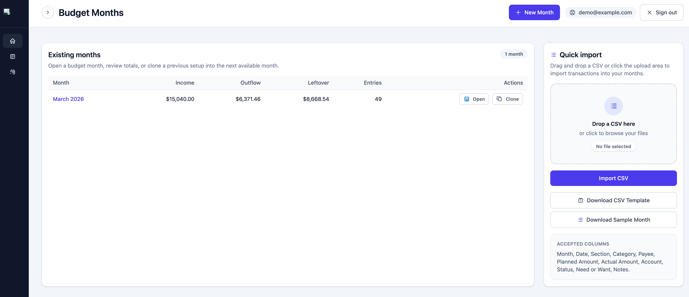
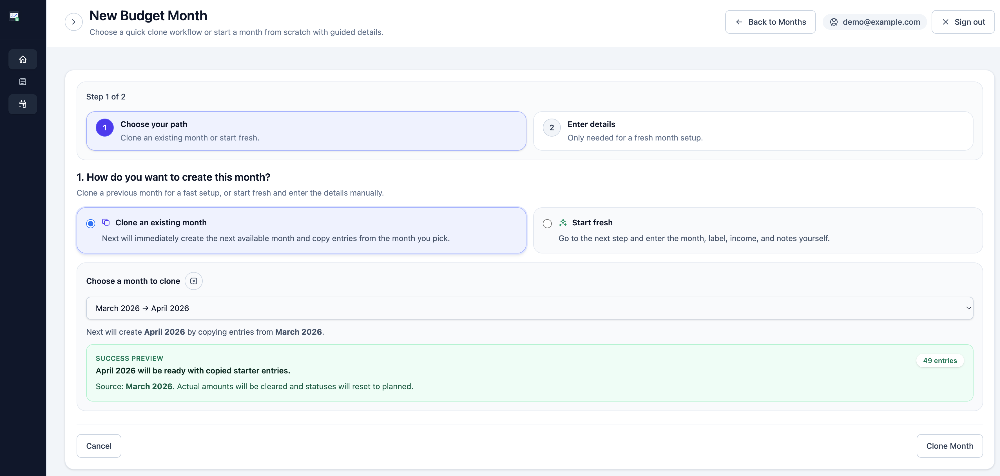
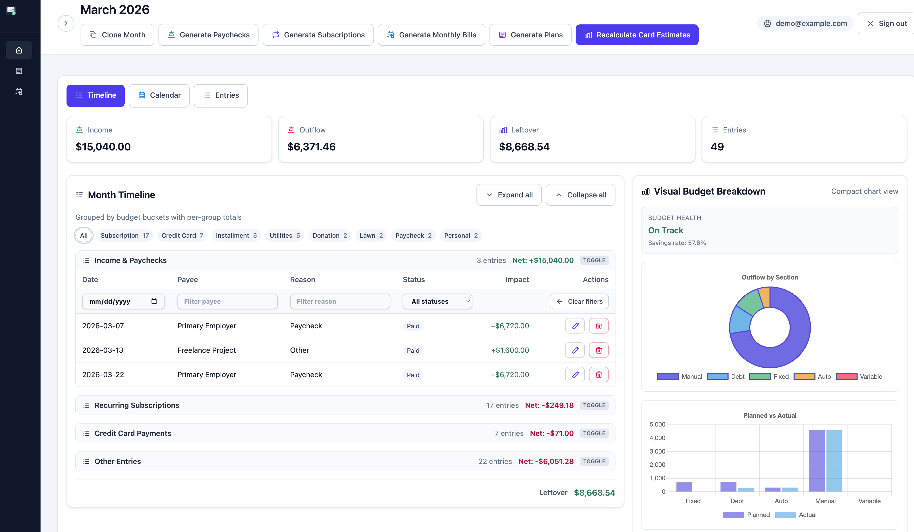
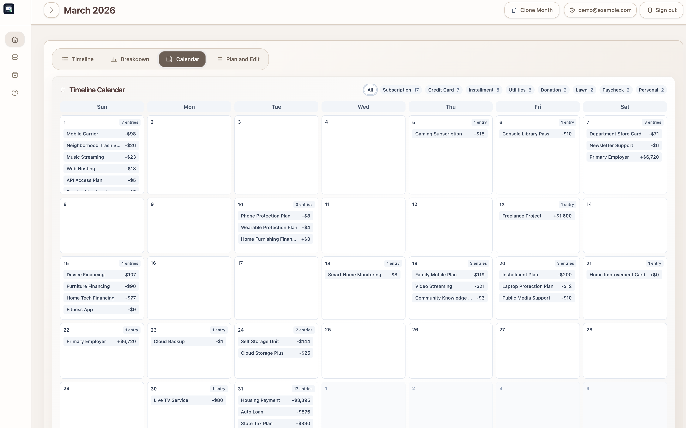

# Expense Tracker

A budgeting app for building month-by-month spending plans, tracking real activity, and reusing the recurring parts of a household budget.

## Table of Contents

- [Overview](#overview)
- [Quick Start (Docker)](#quick-start-docker)
- [Screenshots](#screenshots)
- [Features](#features)
- [Tech Stack](#tech-stack)
- [Getting Started](#getting-started)
	- [Run with Docker](#run-with-docker)
	- [Run Locally](#run-locally)
- [Authentication](#authentication)
- [Demo and Sample Data](#demo-and-sample-data)
	- [Sample User](#sample-user)
	- [Seeded Demo Month](#seeded-demo-month)
	- [Sample CSV Files](#sample-csv-files)
- [Workflow](#workflow)
	- [Dashboard](#dashboard)
	- [Create a Month](#create-a-month)
	- [Clone Month Behavior](#clone-month-behavior)
	- [Add or Import Entries](#add-or-import-entries)
	- [Configure Recurring Templates](#configure-recurring-templates)
	- [Review a Month](#review-a-month)
- [Open Source Readiness](#open-source-readiness)
- [Development Commands](#development-commands)
- [Troubleshooting](#troubleshooting)
- [Docker Files](#docker-files)

## Overview

Expense Tracker is built for people who budget by month and want one place to plan income, fixed bills, variable spending, debt payments, and carry-over decisions.

With it, a user can:

- build a fresh month or start from a previous month instead of recreating the same structure every time
- review the same budget in a timeline, calendar, or editable list depending on how they like to think about money
- import transactions from CSV files to get a month filled in faster
- reuse recurring items so routine planning takes less manual work
- estimate credit-card payments based on the cash left in the month rather than guessing in isolation

The sections below are split between user-focused guidance for using the app and developer-focused guidance for running, testing, and publishing the project.

For most people, the easiest way to try the app is the Docker setup below because it avoids local Ruby, PostgreSQL, and system package setup.

## Quick Start (Docker)

If the goal is to get the app running as quickly as possible, use Docker:

1. Install Docker Desktop
2. Start the app
	- `docker compose up --build`
3. Open the app
	- http://localhost:3000
4. Optional: load the demo data in another terminal
	- `docker compose exec web bin/rails db:seed`

After seeding, sign in with the demo account described in the [Sample User](#sample-user) section.

## Screenshots

<table>
	<tr>
		<td align="center">
			
			 
			<strong>Dashboard</strong>
			 
			Existing months and quick CSV import.
		</td>
		<td align="center">
			
			 
			<strong>Month Creation Wizard</strong>
			 
			Clone preview and fresh month flow.
		</td>
	</tr>
	<tr>
		<td align="center">
			
			 
			<strong>Monthly Overview</strong>
			 
			Timeline totals, grouped entries, and charts.
		</td>
		<td align="center">
			
			 
			<strong>Calendar View</strong>
			 
			Day-by-day entry layout with reason pills.
		</td>
	</tr>
</table>

## Features

- Plan each month in one place so income, bills, subscriptions, debt payments, and discretionary spending stay visible together
- Start a new month quickly by cloning an existing one, which saves time when your budget structure stays mostly the same
- See your budget in multiple views so you can review the same data as a timeline, a calendar, or a detailed entry list
- Add transactions the way that fits your workflow, whether that means entering them manually, using the guided wizard, or importing a CSV
- Upload past transactions to get a month populated faster instead of rebuilding everything by hand
- Reuse recurring items like paychecks, subscriptions, monthly bills, payment plans, and credit cards so routine planning takes less effort
- Filter entries by the reasons and categories that actually appear in your month, making it easier to focus on specific spending patterns
- Recalculate card payment estimates from available leftover cash so payoff planning stays aligned with the rest of the month
- Avoid accidental duplicate generation on older completed months with safeguards that hide actions you likely no longer need
- Keep each person’s budget private behind sign-in so one account only sees its own months and entries

## Tech Stack

For developers and contributors, the app is built with:

- Ruby 4.0.1
- Rails 8.1.2
- PostgreSQL
- Devise
- Turbo + Stimulus
- Tailwind CSS
- RSpec + FactoryBot

## Getting Started

For most users, Docker is the recommended way to run the app.

Use Docker if you want the quickest path to opening the app without manually setting up Ruby, PostgreSQL, or system dependencies.

Use the local setup only if you plan to develop on the project or prefer managing those dependencies yourself.

### Run with Docker

This is the recommended setup for most users.

The repository includes a Docker-based environment that starts the Rails app and PostgreSQL together.

#### Prerequisites

- Docker Desktop, or Docker Engine + Docker Compose

#### Start the app

1. Build and start the containers
	 - `docker compose up --build`
2. Open the app
	 - http://localhost:3000

Services included:

- `web` — Rails app running via `bin/dev`
- `db` — PostgreSQL 16

The container entrypoint automatically runs `bin/rails db:prepare` when the app starts.

#### Optional: load demo data

In another terminal:

- `docker compose exec web bin/rails db:seed`

This creates a demo account and sample month so you can explore the app right away.

#### Automatic recurring completion

Due recurring template-generated entries are automatically marked as done by setting their status to `paid` and copying the planned amount into the actual amount when needed.

This works in two ways:

- month pages run a small sync when opened, so self-hosted installs still update during normal use
- production also schedules a daily Solid Queue job for unattended auto-completion

For self-hosted production:

- single-server installs can keep using the existing `SOLID_QUEUE_IN_PUMA=true` setup so jobs run inside Puma
- multi-server installs should move job processing to a dedicated `bin/jobs` process or job host

The recurring schedule lives in [config/recurring.yml](config/recurring.yml).

#### Stop the app

- `docker compose down`

To also remove the database volume:

- `docker compose down -v`

### Run Locally

This setup is mainly for developers and contributors.

#### Prerequisites

- Ruby 4.0.1
- Bundler
- PostgreSQL
- libpq development headers
- libvips

Typical macOS setup with Homebrew:

- `brew install postgresql libpq vips`

Make sure PostgreSQL is running before starting the app.

#### Setup

1. Install gems
	 - `bundle install`
2. Prepare the database
	 - `bin/rails db:prepare`
3. Optional: load demo data
	 - `bin/rails db:seed`
4. Start the development server
	 - `bin/dev`

Open http://localhost:3000 and sign in to start creating budget months.

## Authentication

The app requires sign-in so each account only sees its own months, entries, imports, and recurring templates.

You can:

- create a new account from the sign-up page
- sign in with your own account
- use the seeded demo account after running `bin/rails db:seed`

## Demo and Sample Data

This project includes demo data for evaluation and sample files for testing imports.

### Sample User

Running `bin/rails db:seed` creates or updates a demo user you can sign in with:

- Email: `demo@example.com`
- Password: `password123!`

You can override these when seeding with:

- `SEED_USER_EMAIL=your-email@example.com`
- `SEED_USER_PASSWORD=your-password`

### Seeded Demo Month

The seed process also imports:

- `db/seeds/march_2026_transactions.csv`

The demo data also:

- attaches all seeded records to the sample user
- creates starter recurring templates for pay, subscriptions, bills, plans, and cards
- keeps demo cashflow positive for the seeded month
- prints a summary of what was created or refreshed

Income values in the demo seed are inflated by 60% so the sample data stays privacy-friendly while still feeling realistic.

### Sample CSV Files

Sample import files are available in `public/samples/` and downloadable from the app:

- `monthly_transactions_template.csv`
- `sample_month_common_payments.csv`

Expected transaction columns:

- `Month`
- `Date`
- `Section`
- `Category`
- `Payee`
- `Planned Amount`
- `Actual Amount`
- `Account`
- `Status`
- `Need or Want`
- `Notes`

## Workflow

This section explains the main user flow through the app.

### Dashboard

The dashboard is the main starting point after sign-in.

It shows:

- a list of your existing months on the left
- a quick CSV import card on the right
- shortcuts to open or clone a month

Use the quick import card to drag and drop a CSV file or click to browse when you want to bring in transactions quickly.

### Create a Month

Click `New Month` to open the month wizard.

The wizard gives two ways to begin:

- `Clone an existing month`
	- choose a source month
	- review the success preview
	- create the next available month automatically
- `Start fresh`
	- go to the next step
	- enter the month date, label, income, and notes manually

Cloning is useful when most of the next month will look like the last one.

### Clone Month Behavior

When a month is cloned into a new month:

- all entries are copied
- dates are shifted into the target month
- `actual_amount` is cleared
- `status` is reset to `planned`
- `planned_amount` uses the source `actual_amount` when present, otherwise the source `planned_amount`
- the target month is the next available month that does not already exist for that user

### Add or Import Entries

Once a month exists, entries can be added in the way that best matches the situation:

- `Entries` tab
	- add entries manually with the standard form
- `Add Entry with Wizard`
	- use the guided multi-step entry flow
- CSV import
	- import a file from the dashboard
	- imported rows create or update the correct month automatically

Common entry fields include:

- date
- payee
- reason/category
- status
- planned amount
- actual amount
- account
- notes

### Configure Recurring Templates

Use the recurring templates area to save items that should show up again in future months.

Template types include:

- pay schedules
- subscriptions
- monthly bills
- payment plans
- credit cards

This reduces repetitive data entry and keeps recurring planning consistent from month to month.

### Review a Month

Each budget month can be reviewed in three main views:

- `Timeline`
	- grouped view of entries with totals by group
	- row-level filters for date, payee, reason, and status
	- pill filters based on the actual reason values in that month
- `Calendar`
	- date-based view of entries
	- pill filters using the same month-specific reason values
- `Entries`
	- form and tabular management view for direct editing

Additional month actions help keep planning current:

- `Clone Month`
	- create a new month from the current one
- `Add from planning templates`
	- adds planned entries from saved paychecks, subscriptions, monthly bills, and payment plans
	- shown in a lower-priority template actions area on active or incomplete months
	- hidden when an older month appears complete
- `Estimate Card Payments`
	- recomputes estimated credit-card payment entries from available leftover cash

## Open Source Readiness

This section is for maintainers preparing the repository for public sharing.

This repo is already set up to avoid committing the usual local-only files, including:

- `config/*.key`
- `.env*`
- `log/*`
- `tmp/*`
- `storage/*`
- `.vscode/`

Before publishing, review this checklist:

1. Confirm secrets were never committed
	- `config/master.key` is ignored and is not currently tracked.
	- If a real secret was ever committed in the past, rotate it before publishing.
2. Keep deployment config as example-only
	- [config/deploy.yml](config/deploy.yml) now uses placeholder hosts and registry values.
3. Review sample data and screenshots
	- Seed/sample CSVs use generic names and demo content.
	- Screenshots currently show demo data and a demo account identity.
4. Regenerate credentials if needed
	- [config/credentials.yml.enc](config/credentials.yml.enc) is safe to publish only if the matching key is never shared.
	- If you are unsure what is inside, create fresh credentials before publishing.
5. Check git history one more time before pushing
	- Review for accidental secrets, exported data, or personal notes.

Recommended pre-publish commands:

- `git log -- config/master.key`
- `git log -- log/test.log`
- `git grep -n "@"`
- `git grep -n "password"`
- `git grep -n "/Users/"`

## Development Commands

These commands are mainly for local development, debugging, and contribution work.

### Local

- Start app: `bin/dev`
- Prepare DB: `bin/rails db:prepare`
- Seed data: `bin/rails db:seed`
- Run tests: `bundle exec rspec`
- Rails console: `bin/rails console`
- Autoload check: `bin/rails zeitwerk:check`

### Docker

- Start app: `docker compose up --build`
- Seed data: `docker compose exec web bin/rails db:seed`
- Run tests: `docker compose exec web bundle exec rspec`
- Rails console: `docker compose exec web bin/rails console`
- Stop app: `docker compose down`

## Troubleshooting

These notes are intended for contributors running the project locally.

### Port 3000 already in use

Stop the process using it, or change the published port in `docker-compose.yml`.

### Database connection problems

- Local: make sure PostgreSQL is running
- Docker: make sure the `db` container is healthy

### Rebuild Docker after gem changes

- `docker compose up --build`

## Docker Files

These files matter primarily for developers working on the project locally or preparing deployment-related changes.

- `Dockerfile` — production-oriented image
- `Dockerfile.dev` — local development image
- `docker-compose.yml` — local multi-container setup

For local Docker development, use `Dockerfile.dev` and `docker-compose.yml`.
