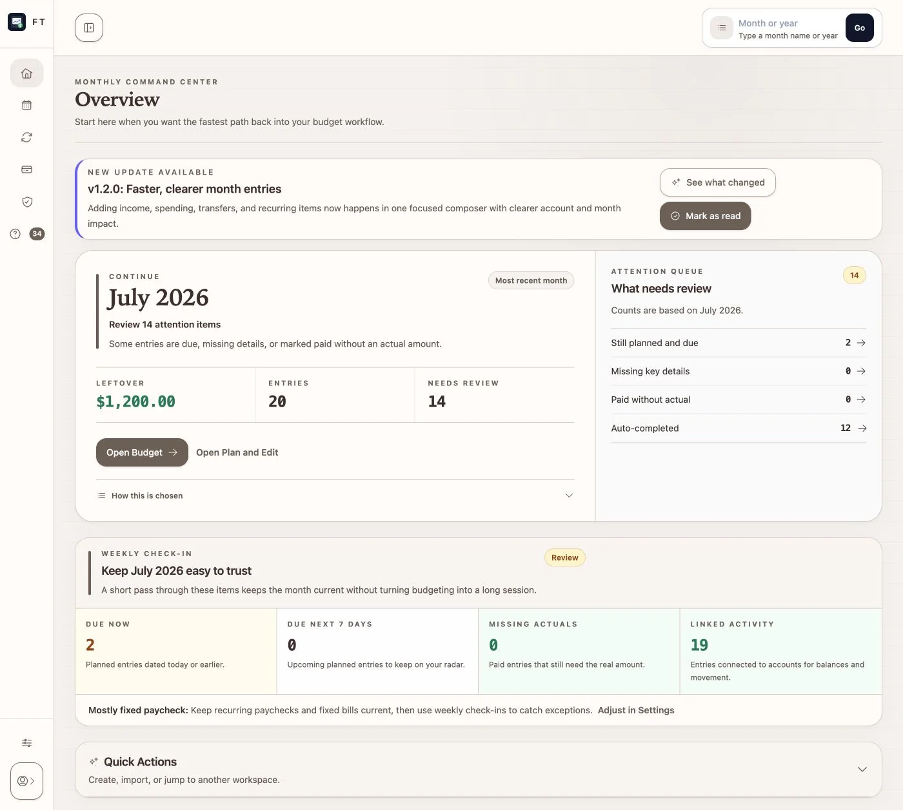
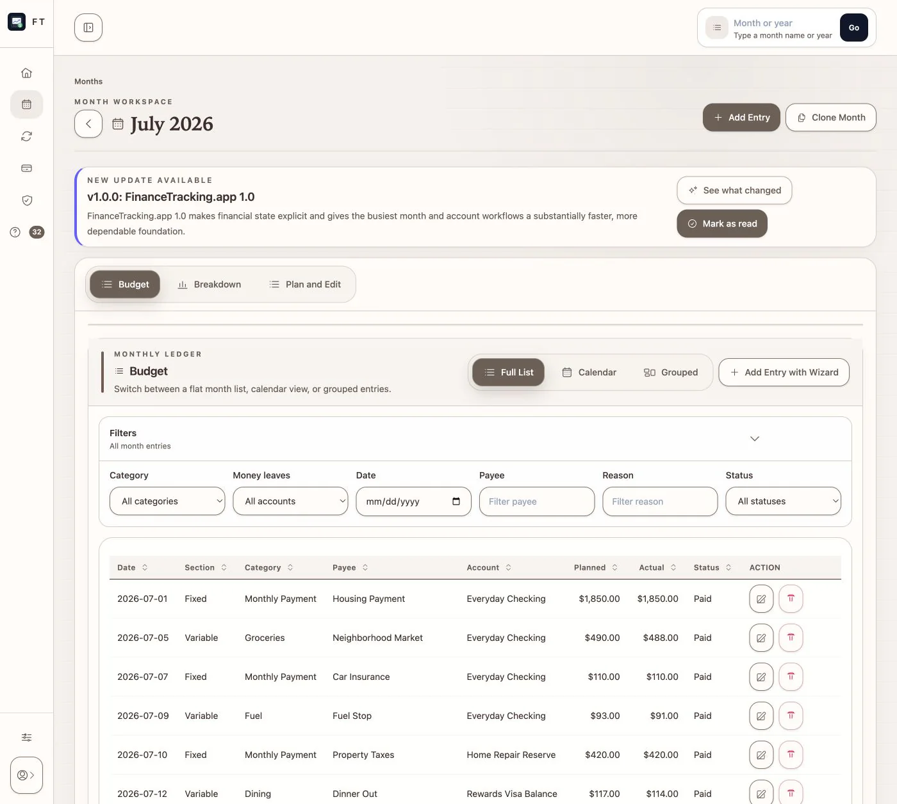
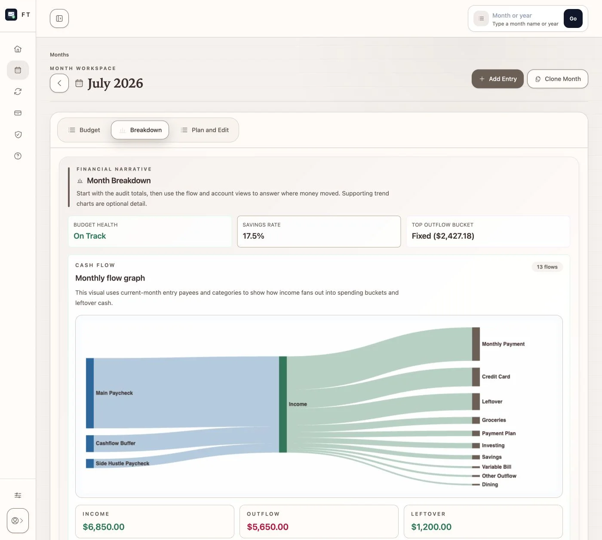
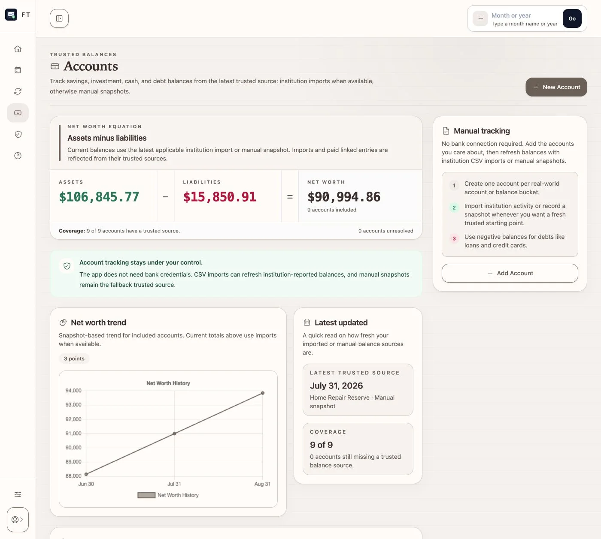
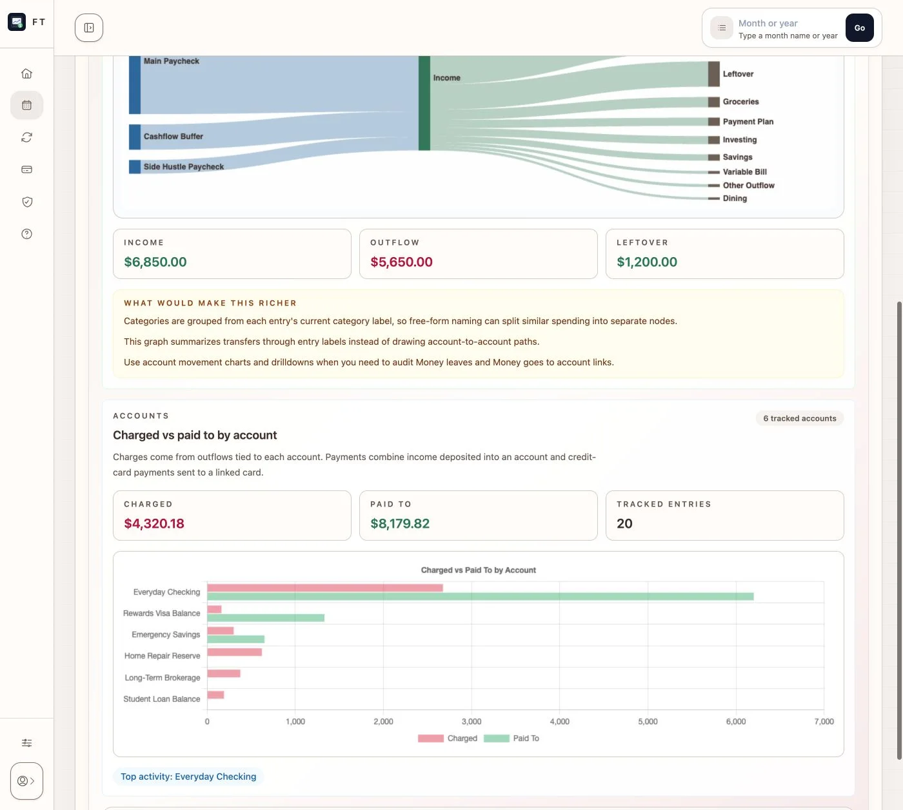
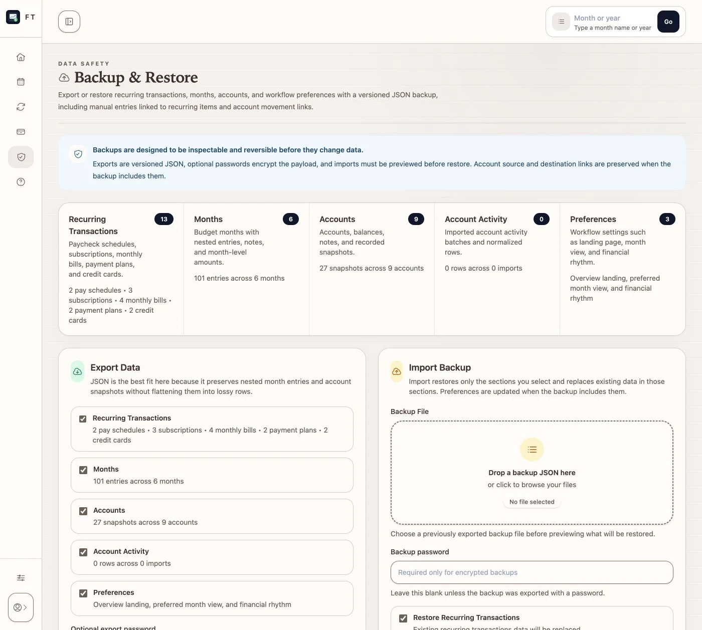

# Expense Tracker

Expense Tracker is a self-hosted Rails app for people who plan their money one month at a time. Build a month from recurring paychecks and bills, record what actually happened, and keep account balances close to the budget.

The app favors manual planning and CSV imports over live bank sync. It is a good fit if you want a private, hands-on budget that you control and host yourself.

[Product overview](https://financetracking.app/) · [User guide](https://financetracking.app/docs/) · [Releases](https://github.com/taimoorq/expense_tracker/releases)

## Contents

- [Quick start](#quick-start)
- [What you can do](#what-you-can-do)
- [Screenshots](#screenshots)
- [How the monthly workflow fits together](#how-the-monthly-workflow-fits-together)
- [Self-hosting](#self-hosting)
- [Demo and sample data](#demo-and-sample-data)
- [Local development](#local-development)
- [Authentication and configuration](#authentication-and-configuration)
- [Troubleshooting](#troubleshooting)

## Quick start

Docker is the shortest path to a working local install. It starts the Rails app and PostgreSQL together.

### 1. Start the app

Install Docker Desktop, or Docker Engine with Compose, then run:

```bash
git clone https://github.com/taimoorq/expense_tracker.git
cd expense_tracker
cp .env.example .env
docker compose up --build
```

Open [http://localhost:4287](http://localhost:4287) and create an account at `/users/sign_up`.

If the Overview page loads after sign-in, the app and database are ready.

### 2. Optional: load a complete demo budget

In another terminal, run:

```bash
docker compose exec web env SEED_MODE=users_with_transactions bin/rails db:seed
```

Then sign in with:

- Email: `demo@example.com`
- Password: `password123!`

These credentials are for local evaluation only. Change them before exposing the app to anyone else.

### 3. Stop the app

```bash
docker compose down
```

Your database stays in the Docker volume. `docker compose down -v` also deletes that volume, so use it only when you want to erase the local database.

### Common quick-start options

- Change the host port: set `APP_PORT` in `.env`, or run `APP_PORT=4317 docker compose up --build`.
- Create an admin during startup: set both `ADMIN_USER_EMAIL` and `ADMIN_USER_PASSWORD` in `.env` before starting the containers.
- Sign in as an admin: open `/admin/sign_in` after the admin account has been created.
- Open the app from another device on your LAN: use `http://YOUR_COMPUTER_IP:4287` and allow the port through your firewall.

## What you can do

- Create a month from scratch or copy an earlier month.
- Reuse paychecks, subscriptions, bills, payment plans, and credit-card payments without rebuilding the same plan each month.
- Add one-off entries by hand or import activity from CSV.
- Review a month as a full list, grouped budget, calendar, breakdown, or money-flow view.
- Track manual balances and snapshots for cash, bank, investment, credit-card, loan, and other accounts.
- Connect budget entries to the accounts money leaves or reaches, then inspect the activity behind balance and movement totals.
- Export versioned JSON backups, optionally encrypt them, preview a restore, and bring the data back into the app.

The app includes in-product help for day-to-day workflows. The hosted [user guide](https://financetracking.app/docs/) covers the same features in more detail.

## Screenshots

<table>
  <tr>
    <td align="center">
      
      <br>
      <strong>Overview</strong>
      <br>
      See the current month, account context, and the next item that needs attention.
    </td>
    <td align="center">
      
      <br>
      <strong>Monthly budget</strong>
      <br>
      Filter and review planned and paid entries without leaving the month.
    </td>
  </tr>
  <tr>
    <td align="center">
      
      <br>
      <strong>Money flow</strong>
      <br>
      Trace how income moved through spending groups across saved months.
    </td>
    <td align="center">
      
      <br>
      <strong>Accounts and net worth</strong>
      <br>
      Keep manual balances, snapshots, and projections beside the budget.
    </td>
  </tr>
  <tr>
    <td align="center">
      
      <br>
      <strong>Account movement</strong>
      <br>
      Open the entries behind bank movement, card charges, and card payments.
    </td>
    <td align="center">
      
      <br>
      <strong>Backup and restore</strong>
      <br>
      Preview a versioned backup before restoring it.
    </td>
  </tr>
</table>

## How the monthly workflow fits together

1. **Set up reusable items.** Add the paychecks, bills, subscriptions, payment plans, and card payments that usually appear each month.
2. **Build the month.** Start fresh, copy an earlier month, or generate entries from the recurring items you want to use.
3. **Keep it current.** Add one-off entries, import CSV activity, and confirm planned entries after the activity occurs. Opening a month never marks entries paid for you.
4. **Review the result.** Use the budget, breakdown, calendar, account, and money-flow views to compare the plan with actual activity.

Accounts are tracked manually. A balance snapshot provides a known starting point; paid activity explains the current balance, and planned activity contributes to the projected balance.

## Self-hosting

The quick start is intended for local evaluation and development. For a public deployment, use the production Compose stack behind the included Caddy reverse proxy.

### Public HTTPS deployment

1. Copy the production environment template.

   ```bash
   cp .env.production.example .env.production
   ```

2. In `.env.production`, set:

   - `APP_HOST` and `ALLOWED_HOSTS` to your domain
   - a strong `POSTGRES_PASSWORD`
   - the matching password inside `DATABASE_URL`
   - valid `SECRET_KEY_BASE` and `RAILS_MASTER_KEY` values

3. Point the domain's DNS record at the server.

4. Start the stack.

   ```bash
   docker compose --env-file .env.production -f docker-compose.production.yml up -d --build
   ```

Caddy is the only service exposed on ports `80` and `443`. Rails and PostgreSQL remain on the internal Docker network.

### Use a published image

For a repeatable deployment, set a versioned image in `.env.production`:

```dotenv
EXPENSE_TRACKER_IMAGE=ghcr.io/taimoorq/expense_tracker:v1.0.0
```

Then pull and start it without building locally:

```bash
docker compose --env-file .env.production -f docker-compose.production.yml pull web
docker compose --env-file .env.production -f docker-compose.production.yml up -d --no-build
```

Use a version tag instead of `latest` when you want controlled upgrades.

### Private LAN HTTPS

For a private hostname such as `budget.lan`, use Caddy's internal certificate authority:

```bash
docker compose --env-file .env.production \
  -f docker-compose.production.yml \
  -f docker-compose.lan-https.yml \
  up -d --build
```

Each client device must trust the root certificate generated in the `caddy_data` volume. Copy it from the running container with:

```bash
docker compose --env-file .env.production \
  -f docker-compose.production.yml \
  -f docker-compose.lan-https.yml \
  cp caddy:/data/caddy/pki/authorities/local/root.crt ./caddy-local-root.crt
```

If you replace the `caddy_data` volume, Caddy may create a new root certificate that clients must trust again.

### Update an install

Before updating, back up PostgreSQL and compare your environment file with the current example for new settings.

For the local Docker setup from the quick start:

```bash
git pull
docker compose up -d --build
```

For a production install built from source:

```bash
git pull
docker compose --env-file .env.production -f docker-compose.production.yml up -d --build
```

For a production install using a published image, change `EXPENSE_TRACKER_IMAGE` to the new version, then run:

```bash
docker compose --env-file .env.production -f docker-compose.production.yml pull web
docker compose --env-file .env.production -f docker-compose.production.yml up -d --no-build
```

The container runs `bin/rails db:prepare` during startup, so migrations are applied automatically. Keep the PostgreSQL volume intact, and do not run `db:seed` during a normal update.

The app also checks GitHub Releases and shows an update notice when a newer release is available. The related overrides are documented in [.env.example](.env.example).

## Demo and sample data

`bin/rails db:seed` creates or refreshes a demo user. By default it adds recurring transactions, linked accounts, and balance snapshots without creating month history.

Add six months of sample history with:

```bash
SEED_MODE=users_with_transactions bin/rails db:seed
```

For Docker, prefix the command with `docker compose exec web env`.

### Seed profiles

Set `SEED_PROFILE` to choose the data shape you need:

| Profile | Useful for |
| --- | --- |
| `demo` | A balanced account with recurring items and optional month history |
| `new_user` | Onboarding and empty-state testing |
| `recurring_heavy` | A large recurring library without month history |
| `month_history_heavy` | Twelve months of budget history |
| `account_heavy` | More account types, snapshots, and linked activity |
| `manual_adjustments` | Skipped items, exceptions, and manual entries |
| `all_test_users` | Every profile in one seed run |

Example:

```bash
SEED_PROFILE=all_test_users SEED_MODE=users_with_transactions bin/rails db:seed
```

You can override the primary demo credentials with `SEED_USER_EMAIL` and `SEED_USER_PASSWORD`.

Sample import files live in [`public/samples/`](public/samples/):

- [`monthly_transactions_template.csv`](public/samples/monthly_transactions_template.csv)
- [`sample_month_common_payments.csv`](public/samples/sample_month_common_payments.csv)

## Local development

Use this path when you want to change the app without Docker.

### Prerequisites

- Ruby 4.0.6
- Bundler
- PostgreSQL
- libpq development headers
- libvips

On macOS with Homebrew:

```bash
brew install postgresql libpq vips
```

Start PostgreSQL, then run:

```bash
cp .env.example .env
bin/setup --skip-server
bin/dev
```

Open [http://localhost:3000](http://localhost:3000).

### Stack

- Rails 8.1.3 and Ruby 4.0.6
- PostgreSQL
- Hotwire with Turbo and Stimulus
- Tailwind CSS through `tailwindcss-rails`
- Propshaft and Importmap
- Chart.js and Apache ECharts
- Rails tests plus RSpec and FactoryBot

### Useful commands

| Task | Command |
| --- | --- |
| Prepare or update the development database | `bin/setup --skip-server` |
| Open a Rails console | `bin/rails console` |
| Run Rails tests | `bin/rails test` |
| Run RSpec | `bundle exec rspec` |
| Run RuboCop | `bin/rubocop` |
| Scan Rails code | `bin/brakeman --no-pager` |
| Audit bundled gems | `bin/bundler-audit` |
| Audit importmap packages | `bin/importmap audit` |
| Check autoloading | `bin/rails zeitwerk:check` |
| Install the tracked pre-commit hook | `bin/rails git_hooks:install` |

The pre-commit hook runs RuboCop against staged Ruby files.

### Releases

`config/releases.yml` is the source for the in-app release feed. Add new releases at the top. When that change lands on `main`, [the release workflow](.github/workflows/publish_release.yml) creates the GitHub release and publishes versioned Docker images.

## Authentication and configuration

Regular and admin accounts use separate sign-in pages:

- Regular users register at `/users/sign_up` and sign in at `/users/sign_in`.
- Admins sign in at `/admin/sign_in`.
- The admin console manages user access and audit history. It does not expose users' budgets, entries, recurring transactions, or account balances.

Set both `ADMIN_USER_EMAIL` and `ADMIN_USER_PASSWORD` to create or update an admin through `bin/setup`, the development Docker entrypoint, or `bin/rails admin:bootstrap`. If only one value is present, bootstrap stops with an error instead of creating a partial account.

The public authentication routes include cache-backed rate limiting. Optional Cloudflare Turnstile protection is enabled when the Rails process receives both `TURNSTILE_SITE_KEY` and `TURNSTILE_SECRET_KEY`.

Common settings are documented in:

- [`.env.example`](.env.example) for local development and Docker
- [`.env.production.example`](.env.production.example) for production

## Troubleshooting

### Port 4287 is already in use

Set another port in `.env`:

```dotenv
APP_PORT=4317
```

Then restart Docker Compose.

### Docker cannot resolve the database host

If the web logs contain `could not translate host name "db" to address`, confirm that both services are running:

```bash
docker compose ps
docker compose logs db
```

Start the complete stack from the repository directory with `docker compose up --build`. The web container expects PostgreSQL at the Compose hostname `db`; running the app container by itself does not provide that network.

### The app works on localhost but not another device

Check the host machine's firewall, use the machine's LAN IP, and confirm both devices are on the same non-isolated network. The development Compose setup accepts non-localhost hosts, but it cannot change firewall or router rules.

### Docker changes break another local network

The Compose files use `172.28.1.0/24` for development and `172.28.2.0/24` for production. If either range overlaps your LAN or VPN, change the corresponding network subnet in the Compose file.

### Gems changed but the container still uses old dependencies

Rebuild the development image:

```bash
docker compose up --build
```

For product workflows and in-app behavior, continue with the [user guide](https://financetracking.app/docs/). For bugs or setup problems, [open a GitHub issue](https://github.com/taimoorq/expense_tracker/issues).
