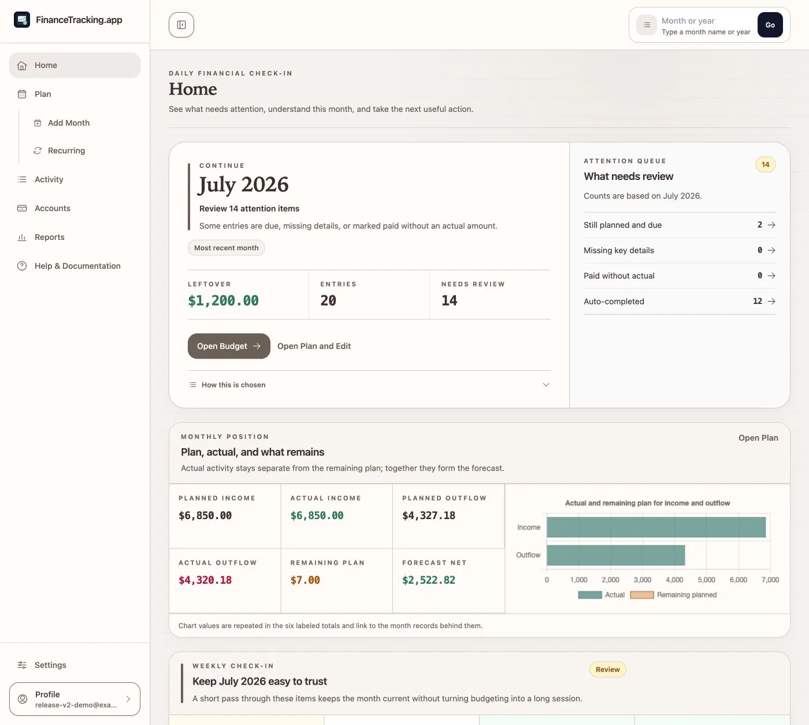
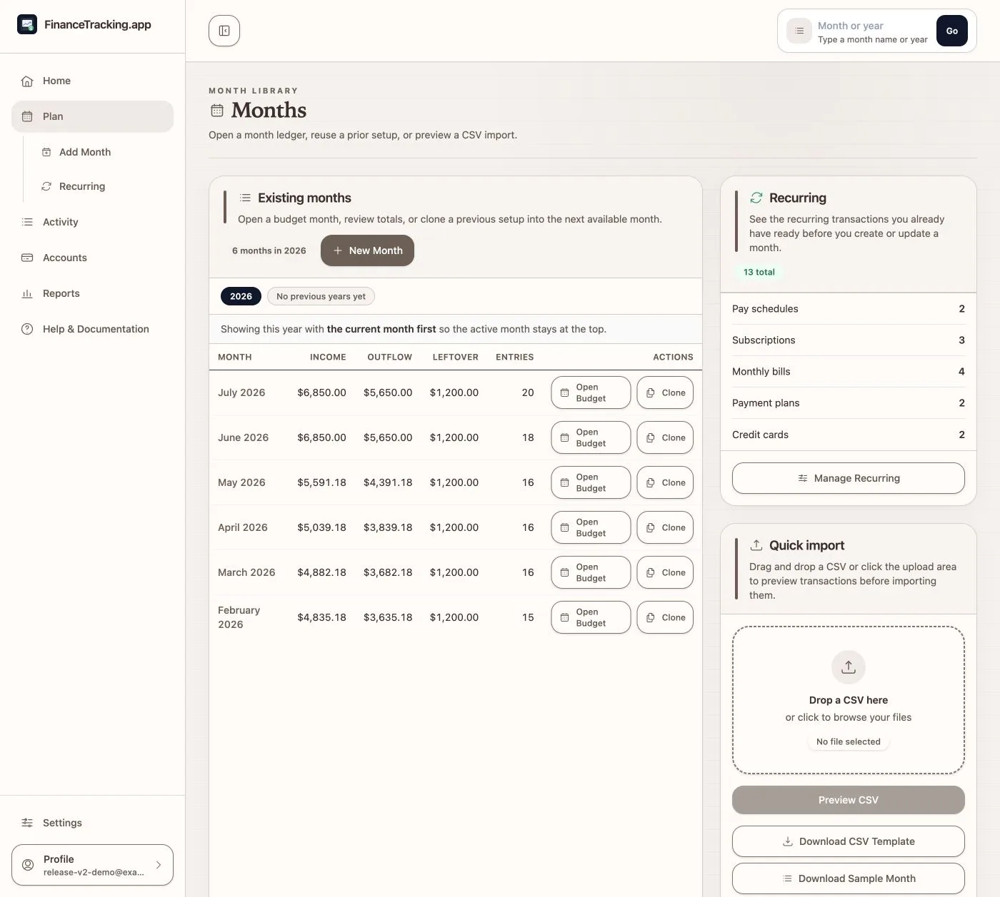
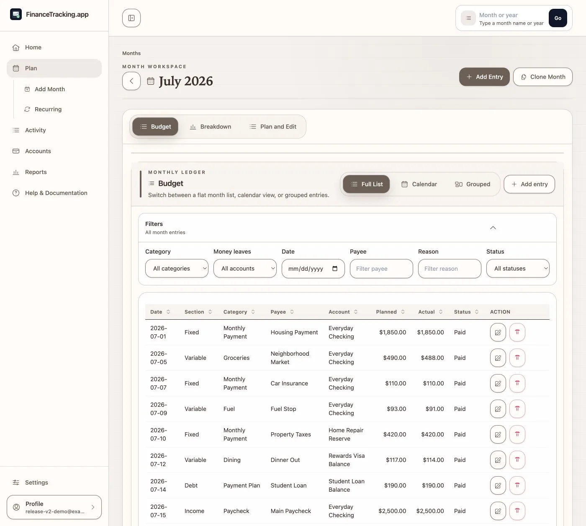
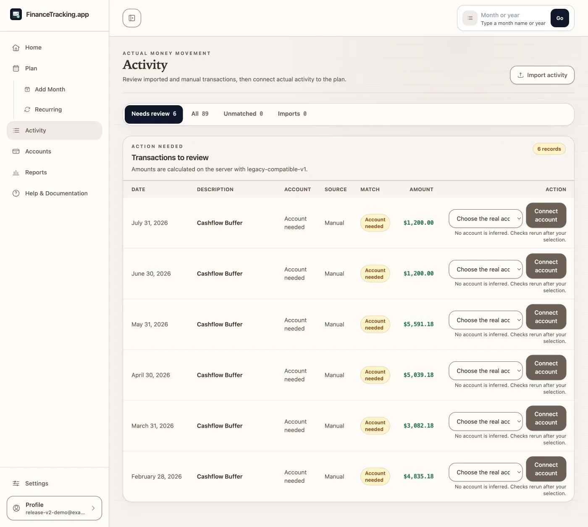
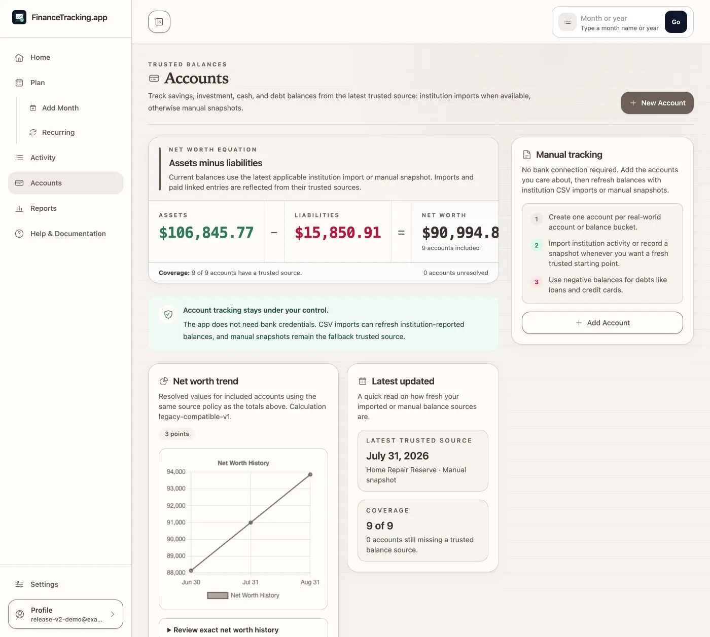
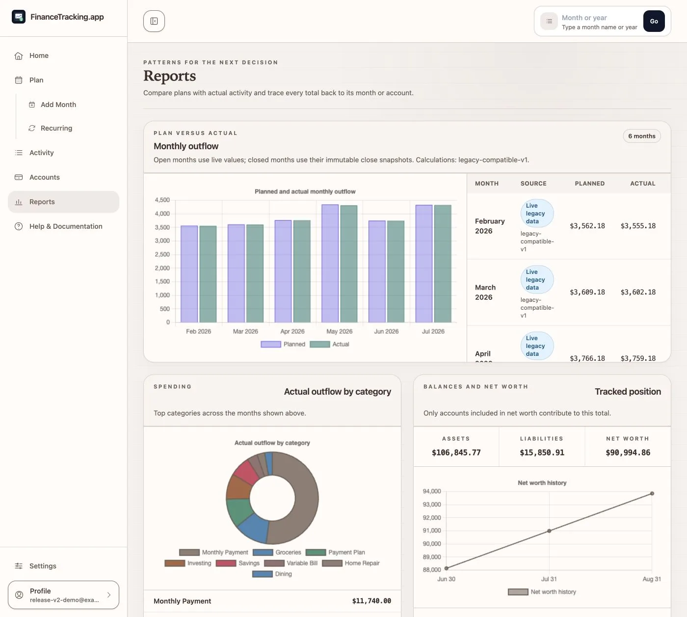
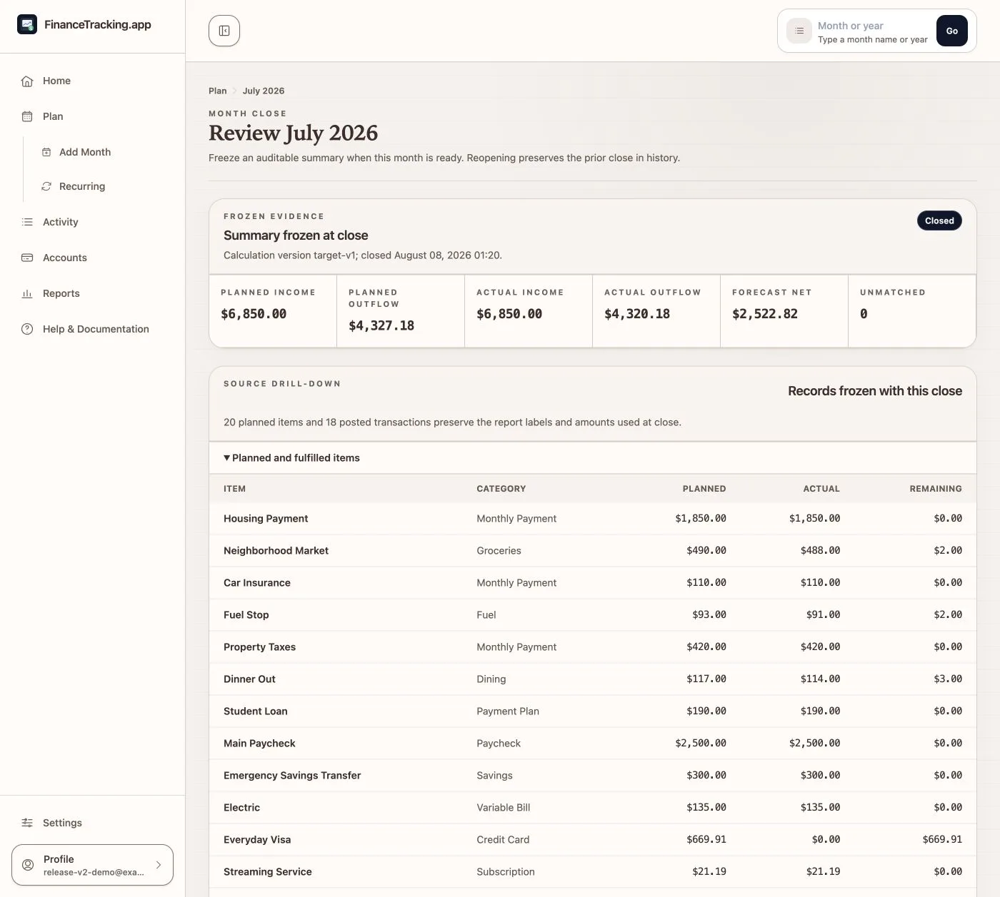
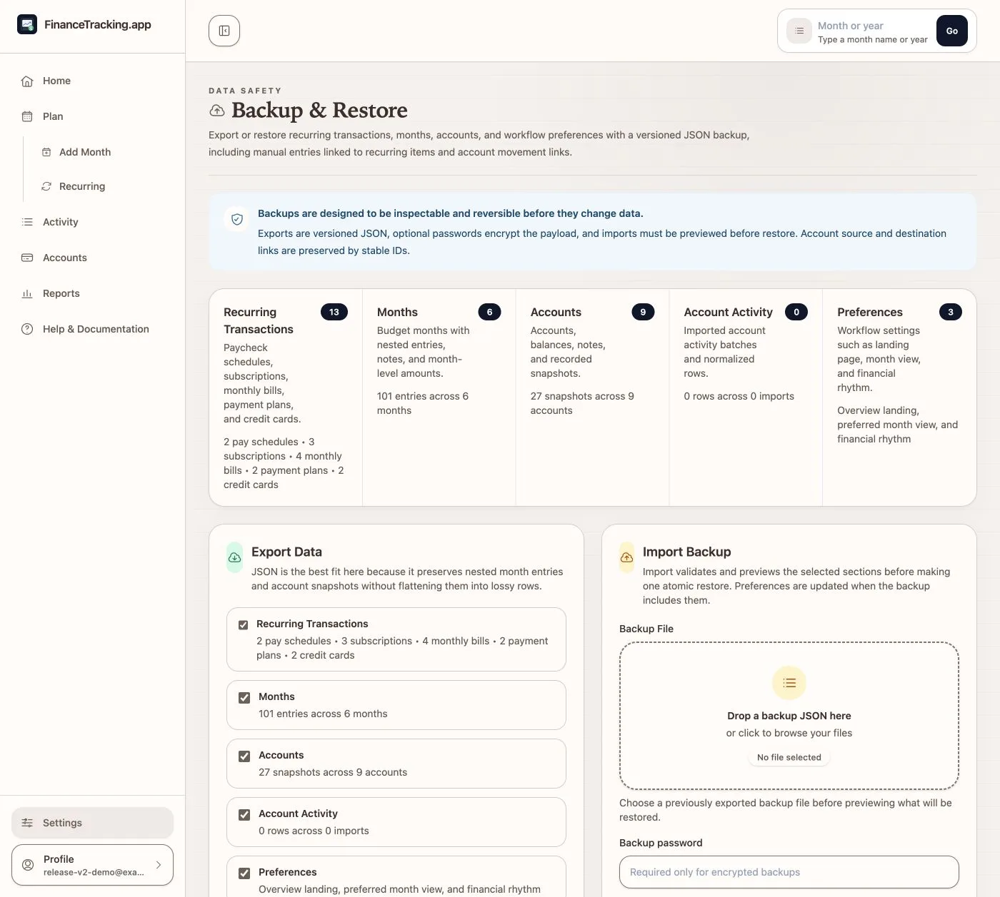

# FinanceTracking.app

FinanceTracking.app is a self-hosted app for people who plan their money one month at a time. Build the plan, record what actually happened, check account balances, and open the transactions behind every report total.

The app favors manual planning and CSV imports over live bank sync. It is a good fit if you want a private, hands-on budget that you control and host yourself.

[Product overview](https://financetracking.app/) · [User guide](https://financetracking.app/docs/) · [Trust center](https://financetracking.app/trust/) · [Support](SUPPORT.md) · [Releases](https://github.com/taimoorq/expense_tracker/releases)

## Contents

- [Quick start](#quick-start)
- [What you can do](#what-you-can-do)
- [Product tour](#product-tour)
- [How the monthly workflow fits together](#how-the-monthly-workflow-fits-together)
- [Self-hosting](#self-hosting)
- [Try it without entering your finances](#try-it-without-entering-your-finances)
- [Local development](#local-development)
- [Authentication and configuration](#authentication-and-configuration)
- [Security and support](#security-and-support)
- [License](#license)
- [Troubleshooting](#troubleshooting)

## Quick start

Docker is the shortest path to a working local install. It starts the app and its database together.

### 1. Start the app

Install Docker Desktop, or Docker Engine with Compose, then run:

```bash
git clone https://github.com/taimoorq/expense_tracker.git
cd expense_tracker
cp .env.example .env
docker compose up --build
```

Open [http://localhost:4287](http://localhost:4287) and create an account at `/users/sign_up`.

If Home opens after sign-in, the app and database are ready.

### 2. Optional: try a complete budget without entering your finances

In another terminal, run:

```bash
docker compose exec web env SEED_MODE=users_with_transactions bin/rails db:seed
```

Then sign in with:

- Email: `demo@example.com`
- Password: `password123!`

These credentials are only for a private trial on your computer. Never reuse them on a server or expose them to anyone else.

### 3. Stop the app

```bash
docker compose down
```

Your database stays in the Docker volume. `docker compose down -v` also deletes that volume, so use it only when you want to erase the local database.

### Common quick-start options

- Change the host port: set `APP_PORT` in `.env`, or run `APP_PORT=4317 docker compose up --build`.
- Create an admin during startup: set both `ADMIN_USER_EMAIL` and `ADMIN_USER_PASSWORD` in `.env` before starting the containers.
- Sign in as an admin: open `/admin/sign_in` after the admin account has been created.
- Open the app from another device on your LAN: use `http://YOUR_COMPUTER_IP:4287` and allow the port through your firewall.

## What you can do

- Start on Home with the current month, items that need review, plan-versus-actual totals, and links to the transactions behind each graph.
- Create a month from scratch or copy an earlier month, then reuse paychecks, subscriptions, bills, payment plans, and credit-card payments.
- Add a one-time item, reuse a regular item, or save new income, bills, and payments for future months.
- Review imported and manual transactions in Activity, match them to the plan, and correct a match without losing history.
- Track confirmed balances for cash, bank, investment, credit-card, loan, and other accounts.
- Compare monthly trends, categories, and account movement in Reports, with exact values and the transactions behind each total.
- Close a month to save the final totals you reviewed, or reopen it when a late transaction needs to be added.
- Download a password-protected backup, preview what a restore would change, and use the seven-day safety copy if you need to undo a replacement restore.

The app includes in-product help for day-to-day workflows. The hosted [user guide](https://financetracking.app/docs/) covers the same features in more detail.

## Product tour

<table>
  <tr>
    <td align="center">
      
      <br>
      <strong>Home</strong>
      <br>
      See what needs attention, understand the month, and open the transactions behind every total.
    </td>
    <td align="center">
      
      <br>
      <strong>Plan</strong>
      <br>
      Open history, create the next month, or carry an earlier structure forward.
    </td>
  </tr>
  <tr>
    <td align="center">
      
      <br>
      <strong>Monthly view</strong>
      <br>
      Move between budget, breakdown, calendar, and planning views without losing the month.
    </td>
    <td align="center">
      
      <br>
      <strong>Activity</strong>
      <br>
      Review transactions, match them to the plan, and correct a match without losing history.
    </td>
  </tr>
  <tr>
    <td align="center">
      
      <br>
      <strong>Accounts</strong>
      <br>
      Check confirmed balances, planned spending, current account positions, and net worth.
    </td>
    <td align="center">
      
      <br>
      <strong>Reports</strong>
      <br>
      Compare trends and categories, then open the transactions behind a total.
    </td>
  </tr>
  <tr>
    <td align="center">
      
      <br>
      <strong>Close the month</strong>
      <br>
      Review the final numbers before closing, and reopen the month if something arrives late.
    </td>
    <td align="center">
      
      <br>
      <strong>Backup and restore</strong>
      <br>
      Protect a backup with a password and see what a restore would change before applying it.
    </td>
  </tr>
</table>

## How the monthly workflow fits together

1. **Add accounts and regular items.** Enter the balances you want to check and save the paychecks, bills, subscriptions, payment plans, and card payments you expect.
2. **Build the plan.** Start fresh, copy an earlier month, or add the regular income and bills you want to use.
3. **Record what happened.** Add a transaction yourself or import account activity, then match it to the plan when both describe the same event.
4. **Check balances and reports.** Use Home, the monthly view, Accounts, and Reports to compare the plan, actual spending, what remains, the forecast, and confirmed balances. Graphs keep exact values and transaction details within reach.
5. **Close and back up.** Close a ready month to save its final totals. Download a backup before important changes; a replacement restore keeps an encrypted seven-day safety copy.

Accounts are tracked manually. A confirmed balance provides a known starting point; completed transactions explain the current balance, and planned transactions contribute to the projected balance.

## Self-hosting

The quick start is for a private trial or local development. Before making the app available on the internet, use the production Compose setup and finish the security and recovery checklist below.

### Public HTTPS deployment

1. Copy the production environment template.

   ```bash
   cp .env.production.example .env.production
   ```

2. In `.env.production`, set:

   - `APP_HOST` and `ALLOWED_HOSTS` to your domain
   - a strong `POSTGRES_PASSWORD`
   - the matching password inside `DATABASE_URL`
   - valid `SECRET_KEY_BASE` and `RAILS_MASTER_KEY` values

3. Point the domain's DNS record at the server.

4. Start the stack.

   ```bash
   docker compose --env-file .env.production -f docker-compose.production.yml up -d --build
   ```

Caddy is the only service exposed on ports `80` and `443`. Rails and PostgreSQL remain on the internal Docker network.

### Use a published image

For a repeatable deployment, set a versioned image in `.env.production`:

```dotenv
EXPENSE_TRACKER_IMAGE=ghcr.io/taimoorq/expense_tracker:v2.1.0
```

Then pull and start it without building locally:

```bash
docker compose --env-file .env.production -f docker-compose.production.yml pull web
docker compose --env-file .env.production -f docker-compose.production.yml up -d --no-build
```

Use a version tag instead of `latest` when you want controlled upgrades.

### Private LAN HTTPS

For a private hostname such as `budget.lan`, use Caddy's internal certificate authority:

```bash
docker compose --env-file .env.production \
  -f docker-compose.production.yml \
  -f docker-compose.lan-https.yml \
  up -d --build
```

Each client device must trust the root certificate generated in the `caddy_data` volume. Copy it from the running container with:

```bash
docker compose --env-file .env.production \
  -f docker-compose.production.yml \
  -f docker-compose.lan-https.yml \
  cp caddy:/data/caddy/pki/authorities/local/root.crt ./caddy-local-root.crt
```

If you replace the `caddy_data` volume, Caddy may create a new root certificate that clients must trust again.

### Update an install

Before updating, back up PostgreSQL and compare your environment file with the current example for new settings.

For the local Docker setup from the quick start:

```bash
git pull
docker compose up -d --build
```

For a production install built from source:

```bash
git pull
docker compose --env-file .env.production -f docker-compose.production.yml up -d --build
```

For a production install using a published image, change `EXPENSE_TRACKER_IMAGE` to the new version, then run:

```bash
docker compose --env-file .env.production -f docker-compose.production.yml pull web
docker compose --env-file .env.production -f docker-compose.production.yml up -d --no-build
```

The container runs `bin/rails db:prepare` during startup, so migrations are applied automatically. Keep the PostgreSQL volume intact, and do not run `db:seed` during a normal update.

The app also checks GitHub Releases and shows an update notice when a newer release is available. The related overrides are documented in [.env.example](.env.example).

### Upgrade an existing installation safely

The update keeps existing budgets available while you run its safety checks. Before switching an existing budget to the new calculations, take both a PostgreSQL backup and an application backup, then complete the checks one budget at a time.

Run the required upgrade checks inside the web container:

```bash
docker compose --env-file .env.production -f docker-compose.production.yml exec web bin/rails data_quality:legacy
docker compose --env-file .env.production -f docker-compose.production.yml exec web env APPLY=1 bin/rails target_backfill:all
docker compose --env-file .env.production -f docker-compose.production.yml exec web bin/rails target_shadow_reads:all
docker compose --env-file .env.production -f docker-compose.production.yml exec web bin/rails target_release:rehearse
docker compose --env-file .env.production -f docker-compose.production.yml exec web bin/rails target_release:status
```

The rehearsal compares the old and new results, checks performance, practices the rollback, and returns the budget to its original state. It prints redacted counts and timings rather than financial values.

Switch one eligible budget only after the rehearsal passes. Replace `WORKSPACE_ID` with the identifier shown by `target_release:status`, and use your own deployment or change identifier:

```bash
docker compose --env-file .env.production -f docker-compose.production.yml exec web \
  env CONFIRM_WORKSPACE_ID=WORKSPACE_ID CHANGE_ID=YOUR_CHANGE_ID \
  bin/rails 'target_release:enable[WORKSPACE_ID]'
```

If a verification check fails after the switch, use the same explicit confirmation to roll back while keeping the information needed to diagnose the problem:

```bash
docker compose --env-file .env.production -f docker-compose.production.yml exec web \
  env CONFIRM_WORKSPACE_ID=WORKSPACE_ID CHANGE_ID=YOUR_INCIDENT_ID \
  bin/rails 'target_release:rollback[WORKSPACE_ID]'
```

Do not switch a budget while `target_release:status` reports unfinished work or an unresolved difference. Review uncertain history in the app instead of guessing which account it belongs to.

## Try it without entering your finances

`bin/rails db:seed` creates or refreshes a local example user. By default it adds regular transactions, linked accounts, and confirmed balances without creating month history.

Add six months of example history with:

```bash
SEED_MODE=users_with_transactions bin/rails db:seed
```

For Docker, prefix the command with `docker compose exec web env`.

### Choose an example profile

Set `SEED_PROFILE` to choose the data shape you need:

| Profile | Useful for |
| --- | --- |
| `demo` | A balanced account with recurring items and optional month history |
| `new_user` | Onboarding and empty-state testing |
| `recurring_heavy` | A large recurring library without month history |
| `month_history_heavy` | Twelve months of budget history |
| `account_heavy` | More account types, confirmed balances, and linked activity |
| `manual_adjustments` | Skipped items, exceptions, and manual entries |
| `all_test_users` | Every profile in one seed run |

Example:

```bash
SEED_PROFILE=all_test_users SEED_MODE=users_with_transactions bin/rails db:seed
```

You can change the example sign-in credentials with `SEED_USER_EMAIL` and `SEED_USER_PASSWORD`.

Example import files live in [`public/samples/`](public/samples/):

- [`monthly_transactions_template.csv`](public/samples/monthly_transactions_template.csv)
- [`sample_month_common_payments.csv`](public/samples/sample_month_common_payments.csv)

## Local development

Use this path when you want to change the app without Docker.

### Prerequisites

- Ruby 4.0.6
- Bundler
- PostgreSQL
- libpq development headers
- libvips

On macOS with Homebrew:

```bash
brew install postgresql libpq vips
```

Start PostgreSQL, then run:

```bash
cp .env.example .env
bin/setup --skip-server
bin/dev
```

Open [http://localhost:3000](http://localhost:3000).

### Stack

- Rails 8.1.3 and Ruby 4.0.6
- PostgreSQL
- Hotwire with Turbo and Stimulus
- Tailwind CSS through `tailwindcss-rails`
- Propshaft and Importmap
- Chart.js and Apache ECharts
- Rails tests plus RSpec and FactoryBot

### Useful commands

| Task | Command |
| --- | --- |
| Prepare or update the development database | `bin/setup --skip-server` |
| Open a Rails console | `bin/rails console` |
| Run Rails tests | `bin/rails test` |
| Run RSpec | `bundle exec rspec` |
| Run RuboCop | `bin/rubocop` |
| Scan Rails code | `bin/brakeman --no-pager` |
| Audit bundled gems | `bin/bundler-audit` |
| Audit importmap packages | `bin/importmap audit` |
| Check autoloading | `bin/rails zeitwerk:check` |
| Install the tracked pre-commit hook | `bin/rails git_hooks:install` |

The pre-commit hook runs RuboCop against staged Ruby files.

### Releases

`config/releases.yml` is the source for the in-app release feed. Add new releases at the top. When that change lands on `main`, [the release workflow](.github/workflows/publish_release.yml) creates the GitHub release and publishes versioned Docker images.

## Authentication and configuration

Regular and admin accounts use separate sign-in pages:

- Regular users register at `/users/sign_up` and sign in at `/users/sign_in`.
- Admins sign in at `/admin/sign_in`.
- The admin console manages user access and audit history. It does not expose users' budgets, entries, recurring transactions, or account balances.

Set both `ADMIN_USER_EMAIL` and `ADMIN_USER_PASSWORD` to create or update an admin through `bin/setup`, the development Docker entrypoint, or `bin/rails admin:bootstrap`. If only one value is present, bootstrap stops with an error instead of creating a partial account.

The public authentication routes include cache-backed rate limiting. Optional Cloudflare Turnstile protection is enabled when the Rails process receives both `TURNSTILE_SITE_KEY` and `TURNSTILE_SECRET_KEY`.

Common settings are documented in:

- [`.env.example`](.env.example) for local development and Docker
- [`.env.production.example`](.env.production.example) for production

## Security and support

Read [SECURITY.md](SECURITY.md) before reporting a suspected vulnerability, and keep security reports out of public issues. The public [trust center](https://financetracking.app/trust/) explains where data lives, which outside services the app contacts, how backups work, and what you need to protect.

For installation help, reproducible bugs, workflow feedback, and support boundaries, read [SUPPORT.md](SUPPORT.md). Never publish credentials, complete environment files, database dumps, bank exports, or real financial screenshots.

## License

FinanceTracking.app is source-available under the [PolyForm Noncommercial License 1.0.0](LICENSE.md). You may use, modify, fork, and redistribute the software for permitted noncommercial purposes under that license.

Commercial use requires separate written permission. See [Commercial Licensing](COMMERCIAL-LICENSING.md) or email [hello@financetracking.app](mailto:hello@financetracking.app) before using the software for a commercial purpose.

Because the license restricts commercial use, FinanceTracking.app should be described as source-available, not open source. The repository, Docker image, and environment-variable identifiers continue to use `expense_tracker` for compatibility.

## Troubleshooting

### Port 4287 is already in use

Set another port in `.env`:

```dotenv
APP_PORT=4317
```

Then restart Docker Compose.

### Docker cannot resolve the database host

If the web logs contain `could not translate host name "db" to address`, confirm that both services are running:

```bash
docker compose ps
docker compose logs db
```

Start the complete stack from the repository directory with `docker compose up --build`. The web container expects PostgreSQL at the Compose hostname `db`; running the app container by itself does not provide that network.

### The app works on localhost but not another device

Check the host machine's firewall, use the machine's LAN IP, and confirm both devices are on the same non-isolated network. The development Compose setup accepts non-localhost hosts, but it cannot change firewall or router rules.

### Docker changes break another local network

The Compose files use `172.28.1.0/24` for development and `172.28.2.0/24` for production. If either range overlaps your LAN or VPN, change the corresponding network subnet in the Compose file.

### Gems changed but the container still uses old dependencies

Rebuild the development image:

```bash
docker compose up --build
```

For product workflows and in-app behavior, continue with the [user guide](https://financetracking.app/docs/). For bugs or setup problems, [open a GitHub issue](https://github.com/taimoorq/expense_tracker/issues).
